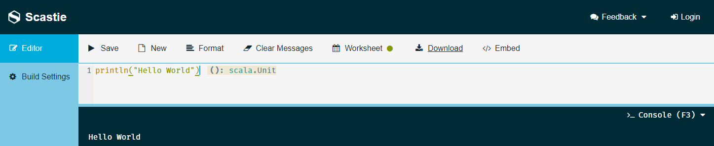
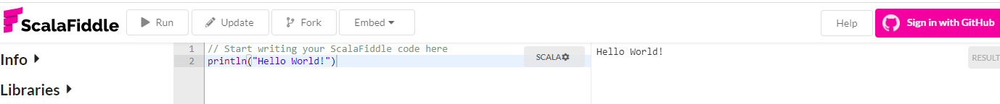

# Introducción a Scala

El nombre de Scala hace referencia a "scalable language". Esto quiere decir que el lenguaje fue diseñado para crecer con la demanda de sus usuarios, una de las propiedades que hace evolucionar a la mayoria de los lenguajes de programación.

Scala es un lenguaje de programación multiparadigma diseñado explicitamente para expresar patrones comunes de programación en forma concisa, elegante y type-safe(con tipos seguros), este último punto busca ayudar a crear aplicaciones con menos errores, uno de los puntos cruciales en el desarrollo de software. Nuestra principal fuente de Scala será la página principal de Scala 
[http://www.scala-lang.org](http://www.scala-lang.org), aqui podremos encontrar los últimos releases de Scala.

La implementación usual de scala se ejecuta en la `JVM` (máquina virtual de Java) y es compatible con las aplicaciones Java existentes, sin embargo, es posible ejecutar scala en el navegador a través de `javascript` y ahora en su versión beta `scala native`, que en algunos de los benchmarks publicados en internet promete ser mucho más rapido para varias aplicaciones, aunque hay varias en las cuales aun palidece contra las otras maneras de ejecutar scala, como es en el clásico problema de [n cuerpos](https://en.wikipedia.org/wiki/N-body_problem). 

Aún se sigue trabajando en mejorar la estabilidad de versiones sin la JVM, con la gran ventaja de que esto implicaria usar hasta 100X veces menos memoria!!! Asi como binarios que ocupan $\frac{1}{3}$ del tamaño de los creados con native image o $\frac{1}{2}$ de los creados con la JVM, asi que en términos de memoria sin lugar a duda es una excelente herramienta.

En Scala las funciones son valores de primera clase, soportando:
- funciones anónimas, 
- funciones de orden superior, 
- funciones anidadas y 
- funcionesd de currificación. 

Scala viene integrado de fábrica con la técnica de `pattern matching` para modelar tipos algebraicos usados en muchos lenguajes funcionales.


## El lenguaje Pizza
Martin Oderszky diseño este lenguaje Pizza donde mostró features que mostraban el poder de combinar programación orientada a objetos con programación funcional.

Scala fue diseñado por Martin Odersky, profesor en  École Polytechnique Fédérale de Lausanne (EPFL). Martin Odersky es el co-creador de `javac.

Los lenguajes estaticamente tipeados han dado origen a decenas de boilerplates. Lo cual no necesariamente es malo, sin embargo para evitar o almenos disminuir esto han tomado auge los lenguajes dinámicos como Python, Ruby, Groovy, etc.

Ahora tenemos Scala un lenguaje estaticamente tipeado, pero los tipos aparecen en los lugares apropiados, la frase en ingles es `tastefully typed language`. Más áun por que usar estrcuturas de datos inmutables, una de las razones fundamentales de esto, es hacer mucho más sencillo el razonamiento y testeo de las fuinciones creadas.

Scala contiene librerias con estructuas de datos mutables e inmutables, asi como evaluaciones estrictas(strict) y peresozas(lazy).


## Como instalar Scala 

Por ahora trabajaremos con la [versión 2.12.12 de Scala](https://www.scala-lang.org/download/2.12.12.html)
para ellos necesitaremos los siguiente pasos:

1.  Java 8 JDK (o JAVA 11) para revisar esto abre una terminal y teclea `java -version` deberia decir `version 1.8` o `version 11.`, si no es alguna de estas versiones [descarga Java](https://www.oracle.com/java/technologies/downloads/#java8), tambien esta disponible la versión libre [OpenJDK](https://adoptopenjdk.net/).
2.  [Instala Scala  2.12.12](https://www.scala-lang.org/download/2.12.12.html) tenemos la versión con IDE o la versión que solo usa linea de comando con SBT.

SBT te permitira instalar especificas versiones de Scala para cada uno de tus proyectos.

### Windows

[Descarga](https://downloads.lightbend.com/scala/2.12.12/scala-2.12.12.msi) el binario

### macOS
```cmd
brew update
brew install scala
```

### SDKMAN
Usando [SDKMAN](https://sdkman.io/)
```cmd
sdk install scala 2.12.12
```

### MacPorts
```cmd
sudo port install scala2.12.12
```

### Scatie
Tambien podemos usar scala en el nuestro navegador con [Scatie](https://scastie.scala-lang.org/)




### ScalaFidle
Tambien podemos usar scala en el nuestro navegador con [ScalaFiddle](https://scalafiddle.io/)




Si instalaste IntelliJ IDEA desde su sitio oficial no olvides instalar el plugin de Scala.
Una vez que crees un proyecto tendras que elegir que herramienta utilizar para crear proyectos en Scala.


# Hello World

Para crear un objeto `HelloWorld` basta con crear un archivo 
`HelloWorld.scala` y crear el objecto usando la palabra reservada `object`

```scala
object HelloWorld{
    println("Hello World!")
}
```

## Read Eval Print Loop (REPL)

Ahora para poder ejecutar una instrucción en escala que ejecute o instancia un objeto, primero mandamos llamar scala para que el interprete sea ejecutado, esto lo logramos abriendo una consola y ejecutando la instrucción `scala`:

```scala
PS P:\CURSOS_PEPEMXL\Scala-Notes\codigos\clase_01> scala
Welcome to Scala 2.13.6 (Java HotSpot(TM) 64-Bit Server VM, Java 1.8.0_40).
Type in expressions for evaluation. Or try :help.

scala>
```

Corremos la instrucción más sencilla:
```scala
println("Hello World")
```
con esto ya sabemos que Scala esta fuincionando.

para salir de la consola interactiva de scala podemos teclear `:quit` o simplemente `Ctrl-D` .


## Creación de Objetos en Scala

Ahora para crear un objeto de scala normalmente hariamos lo siguiente en un lenguaje orientado a objectos:

```scala
object HelloWorldClassic {
  def main(args: Array[String]): Unit = {
    println("Classic Hello World!")
  }
}
```
**Notar que apartir de la versión 2.13 es necesario agregar `: Unit =` lo cual le dice que está regresando un objeto del tipo HelloWorldClassic**

sin embargo para permitirle correr en consola le podemos decir que extienda del objeto `App`, lo cual es un poco más sencillo para ejecutar una aplicación de consola desde el IDE.

```scala
object HelloWorld extends App {
    println("Hello World!")
}
```

Para compilar el código desde consola basta con correr: 
```bash
scalac HelloWorld.scala
```
 esto generara una lista de archivos:
 ```bash
09/24/2021  07:15 AM    <DIR>          .
09/24/2021  07:15 AM    <DIR>          ..
09/24/2021  07:15 AM             2,535 HelloWorld$.class
09/24/2021  07:15 AM               725 HelloWorld$delayedInit$body.class
09/24/2021  07:15 AM               883 HelloWorld.class
09/24/2021  07:15 AM                63 HelloWorld.scala
               4 File(s)          4,206 bytes
               2 Dir(s)  260,320,866,304 bytes free
```

y para ejecutar este programa basta con el comando `scala HelloWorld`

```cmd
C:\Scala-Notes\codigos\clase_01>scala HelloWorld
Hello World!
```

para poder ver las fases de compilación en scala basta con correr la instrucción `scalac Xshow-phases`

```bash
C:\Scala-Notes\codigos\clase_01>scalac -Xshow-phases
    phase name  id  description
    ----------  --  -----------
        parser   1  parse source into ASTs, perform simple desugaring
         namer   2  resolve names, attach symbols to named trees
packageobjects   3  load package objects
         typer   4  the meat and potatoes: type the trees
superaccessors   5  add super accessors in traits and nested classes
    extmethods   6  add extension methods for inline classes
       pickler   7  serialize symbol tables
     refchecks   8  reference/override checking, translate nested objects
        patmat   9  translate match expressions
       uncurry  10  uncurry, translate function values to anonymous classes
        fields  11  synthesize accessors and fields, add bitmaps for lazy vals
     tailcalls  12  replace tail calls by jumps
    specialize  13  @specialized-driven class and method specialization
 explicitouter  14  this refs to outer pointers
       erasure  15  erase types, add interfaces for traits
   posterasure  16  clean up erased inline classes
    lambdalift  17  move nested functions to top level
  constructors  18  move field definitions into constructors
       flatten  19  eliminate inner classes
         mixin  20  mixin composition
       cleanup  21  platform-specific cleanups, generate reflective calls
    delambdafy  22  remove lambdas
           jvm  23  generate JVM bytecode
      terminal  24  the last phase during a compilation run
```

Como podemos ver el paso 23 es genera el JVM bytecode.
Hablaremos del resto de los pasos de compilación más adelante.

Inclusive podemos analizar el código generado usando: `javap`

```bash
javap -p -v HelloWorld.class
```

```cmd
C:\Scala-Notes\codigos\clase_01>javap -p -v HelloWorld.class
Classfile /C:/Scala-Notes/codigos/clase_01/HelloWorld.class
  Last modified Sep 24, 2021; size 883 bytes
  SHA-256 checksum 20476dd1b48165201695274162bbad595b2a507b1d3cc45534d001466de2d4be
  Compiled from "HelloWorld.scala"
public final class HelloWorld
  minor version: 0
  major version: 52
  flags: (0x0031) ACC_PUBLIC, ACC_FINAL, ACC_SUPER
  this_class: #2                          // HelloWorld
  super_class: #4                         // java/lang/Object
  interfaces: 0, fields: 0, methods: 3, attributes: 3
Constant pool:
   #1 = Utf8               HelloWorld
   #2 = Class              #1             // HelloWorld
   #3 = Utf8               java/lang/Object
   #4 = Class              #3             // java/lang/Object
   #5 = Utf8               HelloWorld.scala
   #6 = Utf8               Lscala/reflect/ScalaSignature;
   #7 = Utf8               bytes
   #8 = Utf8               \u0006\u0005Y9Qa\u0001\u0003\t\u0002\u001d1Q!\u0003\u0003\t\u0002)AQ\u0001F\u0001\u0005\u0002U\t!\u0002S3mY><vN\u001d7e\u0015\u0005)\u0011a\u0002\u001ff[B$\u0018PP\u0002\u0001!\tA\u0011!D\u0001\u0005\u0005)AU\r\u001c7p/>\u0014H\u000eZ\n\u0004\u0003-\t\u0002C\u0001\u0007\u0010\u001b\u0005i!\"\u0001\b\u0002\u000bM\u001c\u0017\r\\1\n\u0005Ai!AB!osJ+g\r\u0005\u0002\r%%\u00111#\u0004\u0002\u0004\u0003B\u0004\u0018A\u0002\u001fj]&$h\bF\u0001\b\u0001

...

  #38 = Utf8               RuntimeVisibleAnnotations
  #39 = Utf8               ScalaSig
{
  public static void main(java.lang.String[]);
    descriptor: ([Ljava/lang/String;)V
    flags: (0x0009) ACC_PUBLIC, ACC_STATIC
    Code:
      stack=2, locals=1, args_size=1
         0: getstatic     #17                 // Field HelloWorld$.MODULE$:LHelloWorld$;
         3: aload_0
         4: invokevirtual #19                 // Method HelloWorld$.main:([Ljava/lang/String;)V
         7: return
      LocalVariableTable:
        Start  Length  Slot  Name   Signature
            0       8     0  args   [Ljava/lang/String;
    MethodParameters:
      Name                           Flags
      args                           final

  public static void delayedInit(scala.Function0<scala.runtime.BoxedUnit>);
    descriptor: (Lscala/Function0;)V
    flags: (0x0009) ACC_PUBLIC, ACC_STATIC
    Code:
      stack=2, locals=1, args_size=1
         0: getstatic     #17                 // Field HelloWorld$.MODULE$:LHelloWorld$;
         3: aload_0
         4: invokevirtual #26                 // Method HelloWorld$.delayedInit:(Lscala/Function0;)V
         7: return
      LocalVariableTable:
        Start  Length  Slot  Name   Signature
            0       8     0  body   Lscala/Function0;
    Signature: #23                          // (Lscala/Function0<Lscala/runtime/BoxedUnit;>;)V
    Deprecated: true
    MethodParameters:
      Name                           Flags
      body                           final

  public static long executionStart();
    descriptor: ()J
    flags: (0x0009) ACC_PUBLIC, ACC_STATIC
    Code:
      stack=2, locals=0, args_size=0
         0: getstatic     #17                 // Field HelloWorld$.MODULE$:LHelloWorld$;
         3: invokevirtual #31                 // Method HelloWorld$.executionStart:()J
         6: lreturn
}
SourceFile: "HelloWorld.scala"
RuntimeVisibleAnnotations:
  0: #6(#7=s#8)
    scala.reflect.ScalaSignature(
      bytes="\u0006\u0005Y9Qa\u0001\u0003\t\u0002\u001d1Q!\u0003\u0003\t\u0002)AQ\u0001F\u0001\u0005\u0002U\t!\u0002S3mY><vN\u001d7e\u0015\u0005)\u0011a\u0002\u001ff[B$\u0018PP\u0002\u0001!\tA\u0011!D\u0001\u0005\u0005)AU\r\u001c7p/>\u0014H\u000eZ\n\u0004\u0003-\t\u0002C\u0001\u0007\u0010\u001b\u0005i!\"\u0001\b\u0002\u000bM\u001c\u0017\r\\1\n\u0005Ai!AB!osJ+g\r\u0005\u0002\r%%\u00111#\u0004\u0002\u0004\u0003B\u0004\u0018A\u0002\u001fj]&$h\bF\u0001\b\u0001"
    )
  ScalaSig: length = 0x3 (unknown attribute)
   05 02 00
```

## Java + Scala

Para poder interactuar con código u objetos en JAVA tenemos helpers
que nos ayudan a convertir objetos en Java a objectos en Scala. Por ejemplo:
```scala
import java.util
import scala.jdk.CollectionConverters._

object WithJava extends App {
    val numbersInJava: util.List[Int] = util.Arrays.asList(1,2,3,4,5)
    val numbersInScala: scala.collection.mutable.Buffer[Int] = numbersInJava.asScala
    numbersInScala.foreach(number => println(number))
}
```

donde un arreglo de enteros en java es convertido a un arreglo de enteros en Scala.

```cmd
C:\Scala-Notes\codigos\clase_01>scalac WithJava.scala

C:\Scala-Notes\codigos\clase_01>scala WithJava
1
2
3
4
5
```

## Llendo del paradigma imperativo al funcional

```scala
def printArgs(args: Array[String]): Unit = {
  var i = 0
  while (i < args.length) {
    println(args(i))
    i += 1
  }
}
```
en un modo más funcional podria ser:

```scala
def printArgs(args: Array[String]): Unit = {
  for (arg <args)
    println(arg)
}
```
inclusive un poco más

```scala
def printArgs(args: Array[String]): Unit = {
  args.foreach(println)
}
```
Ahora que para dejar por completo los efectos secundarios(side effects) simplemente darle un formato al arreglo de argumentos, esto es una manera más funcional de crear una función en Scala:
```scala
def formatArgs(args: Array[String]) = args.mkString("\n")
```
