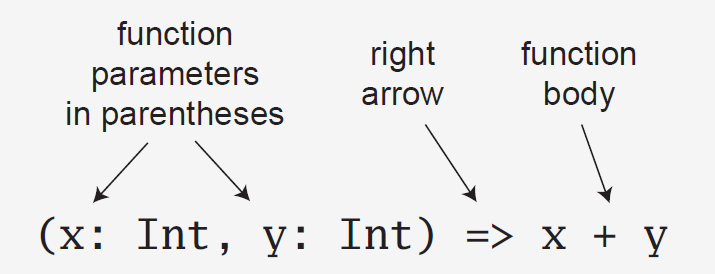

# SBT

Para iniciar un proyecto con SBT necesitamos crear una carpeta, y dentro de ella poner una archivo `build.sbt` y dentro del archivo agregar la linea `scalaVersion := "2.12.4"` tener cuidado con el encoding de dicho archivo o sbt no reconocerá el archivo, como un archivo de configuración valido.


```scala
C:\Scala-Notes\codigos\clase_02> sbt
```

```scala
PS D:\CURSOS\Scala-Notes\codigos\clase_02\myproject> sbt
[info] Updated file D:\CURSOS\Scala-Notes\codigos\clase_02\myproject\project\build.properties: set sbt.version to 1.5.5
[info] welcome to sbt 1.5.5 (Oracle Corporation Java 1.8.0_301)
[info] loading global plugins from C:\Users\pepem\.sbt\1.0\plugins
[info] loading project definition from D:\CURSOS\Scala-Notes\codigos\clase_02\myproject\project
[info] loading settings for project myproject from build.sbt ...
[info] set current project to myproject (in build file:/D:/CURSOS/Scala-Notes/codigos/clase_02/myproject/)
[info] sbt server started at local:sbt-server-908e284b5fd168a62f1c
[info] started sbt server
sbt:myproject>
```

Para reabrir el proyecto de manera interactiva utilizamos el comando `sbt console`


```scala
PS D:\CURSOS\Scala-Notes\codigos\clase_02> cd .\myproject\
PS D:\CURSOS\Scala-Notes\codigos\clase_02\myproject> sbt console
[info] welcome to sbt 1.5.5 (Oracle Corporation Java 1.8.0_301)
[info] loading global plugins from C:\Users\pepem\.sbt\1.0\plugins
[info] loading project definition from D:\CURSOS\Scala-Notes\codigos\clase_02\myproject\project
[info] loading settings for project myproject from build.sbt ...
[info] set current project to myproject (in build file:/D:/CURSOS/Scala-Notes/codigos/clase_02/myproject/)
[info] Non-compiled module 'compiler-bridge_2.12' for Scala 2.12.12. Compiling...
[info]   Compilation completed in 12.035s.
[info] Starting scala interpreter...
Welcome to Scala 2.12.12 (Java HotSpot(TM) 64-Bit Server VM, Java 1.8.0_301).
Type in expressions for evaluation. Or try :help.

scala>
```

# Inmutabilidad

$$x = 1$$
$$y = 2$$
$$x = x+y \quad  o\quad z = x+y$$

El lado izquierdo sería un ejemplo de mutabilidad, que normalmente trataremos de evitar en Scala, el lado derecho de la ecuación  muestra la forma apropiada de crear una nueva variable que contenga la suma de ambas variables previamente definidas.

En que nos ayuda la iunmutabilidad:
- Es más sencillo entender el código, cuando depuramos un código es más sencillo mantener el estado de las variables si estas no cambian de valor..
- Evita cambiar valores de manera accidental.
- Ayuda a paralelizar procesos ya que no tenemos que bloquear el acceso a variables ya que estas no cambian!!!
 


# Expresiones y Enunciados (Expressions and Statements)

Una expresión es algo que produce un valor como resultado, por ejemplo:

```scala
x = 1
y = 2
x+y
getSquare(number)
```
mientras que un enunciado es una linea de código que hace alguna acción, por ejemplo:

```scala
println("Hello World!!!")
```
Le ordena imprimir en consola la frase `Hello World!!!`

```scala
bookOrder(order)
```
Le dice al sistema que realice las tareas necesarias para hacer una reservación.

En general las expresiones:

- No tienen efectos colaterales
- 


mientras que los enunciados:
- Podrían contener efectos colaterales o secundarios.


# Scala REPL

Abran una consola con escala e introduzcan las siguiente expresión:

```scala
1+2
```scala
y den enter, en ese momento les regresará
```scala
val res0: Int = 3
```

la palabra reservada val les dice qu se crei una variable inmutable con el nombre `res0`, despues de los dos puntos `:` tenemos el tipo de dato, que en este caso es un entero después el valor de esta variables `3`.

```scala
scala> "Hello" + " World!!!"
val res1: String = Hello World!!!
```

Podemos reutilizar uno de los resultados anteriores


```scala
scala> res0*10
val res2: Int = 30
```

Podemos poner un enunciado como el siguiente
```scala
scala> println("Hello World!")
Hello World!
```

esta última no genero una variable para guardar el valor por que ejecutamos un enuciado y no una expresión.


# Variables y Valores
Scala contiene dos tipos de variables
- `var` es por definición una variable `mutable`, es decir, a está variables se le puede reasignar un valor del mismo tipo.
- `val` es por definición una variable `inmutable`, es decir, a está variables NO se le puede reasignar un valor.


La variables `var` son aquellas que pueden cambiar durante la ejecucion de nuestros programas, mientras que las variables `val` no pueden ser cambiadas.


Un importante aspecto a considerar es que auqnue no podemos reasignar una variable `val` si podemos recrear la variable `val`.

```scala
scala> val x = 5
x: Int = 5

scala> val x = 7
x: Int = 7

scala> x
res2: Int = 7
```

Aunque aparentemente solo hizo una reasignación del valor, realmente está creando un nuevo scope!!!

para comprobar este analizemos el siguiente código:

```scala
scala> :paste
// Entering paste mode (ctrl-D to finish)

val x = 5
println(x)
val x = 7
println(x)

// Exiting paste mode, now interpreting.

<pastie>:14: error: x is already defined as value x
val x = 7
```
Al estar en el mismo scope no nos deja redeclarar la misma variable, pero si agregamos un scope:

```scala
scala> :paste
// Entering paste mode (ctrl-D to finish)

val x = 5
println(x)

{
  val x = 7
  println(x)
}

// Exiting paste mode, now interpreting.

5
7
x: Int = 5
```

Como podemos ver aunque dentro del scope las llaves existe una variable val, esta variable val no es la misma que esta en el scope superior y el cual es preservado después de correr la rutina. Asi que aunque el código en el modo interactivo pudiera parecer el mismo este puede hacer cosas muy diferentes al que realiza un bloque de código que vive en el mismo scope!!!

A diferencia de otros lenguajes la siguiente asignación NO es valida

```scala
var x = y = 5
```

el resultado esperado, seria `x = 5` y `y = 5`, sin embargo en este caso `x` solo guardara el resultado de la asignación `y = 5` es decir un Unit. La forma correcta de realizar esta asignación es:

```scala
var x, y = 5
```


## Tipos de datos

Cuando declaramos una variable var en Scala, Scala infiere el tipo de dato al que pertence, podemos hacer reasignaciones con valores que pertenecen al mismo tipo de dato, pero no a nuevos tipos de datos:

```scala
scala> var z = 10
z: Int = 10

scala> z = 12
z: Int = 12

scala> z = "HOLA MUNDO"
<console>:12: error: type mismatch;
 found   : String("HOLA MUNDO")
 required: Int
       z = "HOLA MUNDO"
           ^
```

Para definir el tipo de dato usamos la sintaxis `var <nombre de la variable>: <Tipo de dato> = <Valor>`
el valor debe ser del tipo especificado!


# Funciones

## ¿Qué es una función?

En análisis matemático, el concepto general de función, se refiere a una regla que asigna a cada elemento de un primer conjunto un único elemento de un segundo conjunto.  -- Wikipedia

# Funciones Puras e Impuras

Las funciones pueden ser de dos tipos:
- Puras 
- Impuras

por ejemplo

consideremos la funcion que suma los valores del 1 al 5.
Basicamente para el mismo conjunto de parametros la funcion siempre regresa lo mismo. A esto le llamamos una **función pura**, en cambio una **función impura** es cuando el resultado para el mismo conjunto de datos puede cambiar, en el sentido matemático no es una función.


La estructura básica de una función es:

`def functionName(argument: Type): ReturnType = {body}`

la palabra reservada `ReturnType` es opcional, usualmente el tipo regresado por una función puede ser 
inferido por Scala, asi que no es necesario especificarlo.

```scala
scala> def add(x: Int , y:Int) = x+y
add: (x: Int, y: Int)Int

scala> add(5,3)
res7: Int = 8
```

Sin embargo los parametros si deben ser especificados:

```scala
scala> def add(x,y) = x+y
<console>:1: error: ':' expected but ',' found.
       def add(x,y) = x+y
```

## Funciones Anonimas

En Scala una función sin nombre en el código se conoce como `función literal`. 



Por ejemplo,
```scala
scala> (x: Int, y: Int) => x+y
res42: (Int, Int) => Int = $Lambda$5206/1379844783@3832902d
```

Hay muchos ejemplos donde se utilizan este tipo de funciones que literalmente son de un solo uso como parámetro
de otra función, por ejemplo para imprimir de manera optima los argumentos:

```scala
args.foreach(arg => println(arg))
```
una ventaja es que el compilador infiere el tipo de dato y en este particular caso no tiene que ser definido, se puede agregar el tipo, sin embargo tendras que hacerlo entre parentesis:

```scala
args.foreach((arg: String) => println(arg))
```

```scala
scala> def plusOneOrZero(number: Int): Int = {
     if (number < 0) 0
     else number + 1
}

scala> plusOneOrZero(-10)
res0: Int = 0
scala> plusOneOrZero(10)
res1: Int = 11
```

# Estructuras de Control Condicional

```scala
val arguments = Array("Monday")
val day = if (!arguments.isEmpty) arguments(0) else "Sunday"
val arguments: Array[String] = Array(Monday)
val day: String = Monday
```

Scala no tiene un `explicit return` literalmente la última expresión se vuelve el valor a retornar!!!!

## Estilo Funcional

```scala
val a = 1;
val b = 2;
val maxSquaredDoubled = if(a > b){
  val aSquared = a*a;
  aSquared*2;
}else{
  val bSquared = b*b;
  bSquared*2;
}

// Exiting paste mode, now interpreting.

a: Int = 1
b: Int = 2
maxSquaredDoubled: Int = 8
```
## Expresiones Try.. Catch.. Finally

En Scala tendremos expresiones en lugar de enunciados para el manejo de excepciones:

```scala
val divided = try {
  10/0
} catch {
  case ae: ArithmeticException => 0
} finally {
  println("Esta linea siempre corre al final y no afecta el resultado")

  42 
}

// Exiting paste mode, now interpreting.

<pastie>:18: warning: multiline expressions might require enclosing parentheses; a value can be silently discarded when Unit is expected
  42
  ^
<pastie>:18: warning: a pure expression does nothing in statement position
  42
  ^
Esta linea siempre corre al final y no afecta el resultado
divided: Int = 0
```

# Estructuras de control while y for

Hay que tomar en cuenta que existen dos clases de loops:
- Imperativos: hacen algo
- Funcionales: regresan algo

Scala solo tiene un constructor para Loop: `while` ( además de su asociado `do..while`), estás son las únicas estructuras de control que regresan un tipo `Unit` equivalente a nada y que se espera que su funcionamiento sea imperativo y no funcional. Este no regresa nada al final, como no es funcional usualmente es reemplazado por las funciones `foreach` o `map` cuando es utilizado en colecciones o por bloques `for` o `yield`.
Una de las razones para seguir usando while es el performance.

### Estructura de control `while`
```scala
var x = 0
while(x < 10){
  println(s"El cuadrado de $x es ${x*x}")
  x += 1
}
// Exiting paste mode, now interpreting.

El cuadrado de 0 es 0
El cuadrado de 1 es 1
El cuadrado de 2 es 4
El cuadrado de 3 es 9
El cuadrado de 4 es 16
El cuadrado de 5 es 25
El cuadrado de 6 es 36
El cuadrado de 7 es 49
El cuadrado de 8 es 64
El cuadrado de 9 es 81
x: Int = 10
```

### Estructura de control `do while`
```scala
var x = 0
do{
  println(s"El cuadrado de $x es ${x*x}")
  x += 1
}while(x < 10)
// Exiting paste mode, now interpreting.

El cuadrado de 0 es 0
El cuadrado de 1 es 1
El cuadrado de 2 es 4
El cuadrado de 3 es 9
El cuadrado de 4 es 16
El cuadrado de 5 es 25
El cuadrado de 6 es 36
El cuadrado de 7 es 49
El cuadrado de 8 es 64
El cuadrado de 9 es 81
x: Int = 10
```

### Estructura de control `for`

En este caso la estructura de control `for` estará creando una variable val para cada iteración.

```scala
scala> val letters = List("a", "b", "c", "d", "e")
val letters: List[String] = List(a, b, c, d, e)

scala> for ( letter <- letters){
     |   println(letter)
     | }
a
b
c
d
e
```
Para ello basta tratar de hacer una reasignación
```scala
scala> :paste
// Entering paste mode (ctrl-D to finish)

val letters = List("a", "b", "c", "d", "e")
for ( letter <- letters){
  letter = "a";
  println(letter)
}

// Exiting paste mode, now interpreting.

<pastie>:18: error: reassignment to val
  letter = "a";
```

Probemos ahora con un Array para verificar que no es debido a la inmutabilidad de las listas.

```scala
scala> :paste
// Entering paste mode (ctrl-D to finish)

val letters = Array("a", "b", "c", "d", "e")
for ( letter <- letters){
  letter = "a";
  println(letter)
}

// Exiting paste mode, now interpreting.

<pastie>:18: error: reassignment to val
  letter = "a";
```

Mientras hagamos operaciones que no modifiquen a dicha variable no tendremos ningún problema:

```scala
scala> val numbers = List(1,2,3,4,5,6,7,8,9,10)
val numbers: List[Int] = List(1, 2, 3, 4, 5, 6, 7, 8, 9, 10)

scala> for(number <- numbers){
     |   if ( number%2 == 0)
     |     println(number)
     | }
2
4
6
8
10
```

Inclusive podemos agregar la condición dentro del parentesis de parámetros del `for`:

```scala
scala> for(number <- numbers  if (number%2==0)){
     |   println(number)
     | }
2
4
6
8
10
```

### Agregar Condiciones Multiples

```scala
scala> for(
     | number<-numbers
     | if(number%2==0)
     | if(number > 2)
     | ) println(number)
4
6
8
10
```


```scala
scala> for( number<-numbers if(number%2==0) if(number > 2)) println(number)
4
6
8
10
```

```scala
 for( number<-numbers ){
   for( letter<-letters ){
     println(number + "=>" + letter)
   }
 }

1=>a
1=>b
1=>c
1=>d
1=>e
2=>a
...
10=>c
10=>d
10=>e
```

```scala
 for{
   number <- numbers 
   letter<-letters
   } println(number + "=>" + letter)

1=>a
1=>b
1=>c
1=>d
1=>e
2=>a
...
10=>c
10=>d
10=>e
```


## yield

```scala
scala> for( number<-numbers ) yield number*2
val res11: List[Int] = List(2, 4, 6, 8, 10, 12, 14, 16, 18, 20)
  
```


# Transparencia Referencial

Decimos que una expresión o función es referencialmente transparente si podemos remplazarla con su valor, sin cambiar el algoritmo regresa el mismo valor que regresaba antes de replazarlo por su valor.

Cuando violamos la referencia transparente:
- Cuando hacemos llamadas de red
- Actualizamos bases de datos
- Escribimos a arhivos de sistema

# Funciones de Orden Superior

Funciones de Order Superior son aquellas funciones proveen una manera de abstraer las partes que no cambian en una función y tomas las que si cambian como un argumento. Esto por supuesto favorece la resusabilidad del código.

```scala
def getApples(basket: List[Fruit]) = for (fruit <- basket if fruit.name == "apple") yield fruit

def getOranges(basket: List[Fruit]) = for (fruit <- basket if fruit.name == "oranges") yield fruit
```

Una manera de optimizar esto es crear funciones de orden superior donde ahora la funcion no solo recibira el arreglo de frutas si no que ademas recibira el filtro que debe aplicar.

```scala
def getFruits(basket: List[Fruit], filterByFruit => Boolean) = for (fruit <- basket if filterByFruit(fruit)) yield fruit
```

```scala
def getApples(basket: List[Fruit]) = getFruits(fruitBasket, (fruit: Fruit) => fruit.name == "apple" )

def getApples(basket: List[Fruit]) = getFruits(fruitBasket, (fruit: Fruit) => fruit.name == "orange" )
```


## Funciones de Orden Superior en Scala

- map
- reduce
- filter 
- fold


# Como correr y cargar scripts hechos con Scala

Nosotros podemos correr scripts hechos con Scala o cargarlos en el REPL.

como ejemplo veamos el siguiente script [hola_mundo.sc](codigos/clase_02/hola_mundo.sc)

cuyo código es el siguiente:

```scala
var x = 0
while(x < 10){
    println(s"Hola mundo ${x+1}")
    x += 1
}
```

para ejecutarlo desde una consola corremos:

```cmd
PS D:\CURSOS\Scala-Notes\codigos\clase_02> scala hola_mundo.sc
Hola mundo 1
Hola mundo 2
Hola mundo 3
Hola mundo 4
Hola mundo 5
Hola mundo 6
Hola mundo 7
Hola mundo 8
Hola mundo 9
Hola mundo 10
```
o

```cmd
PS D:\CURSOS\Scala-Notes\codigos\clase_02> scala
Welcome to Scala 2.12.12 (Java HotSpot(TM) 64-Bit Server VM, Java 1.8.0_301).
Type in expressions for evaluation. Or try :help.

scala> :load hola_mundo.sc
Loading hola_mundo.sc...
x: Int = 0
Hola mundo 1
Hola mundo 2
Hola mundo 3
Hola mundo 4
Hola mundo 5
Hola mundo 6
Hola mundo 7
Hola mundo 8
Hola mundo 9
Hola mundo 10
```


