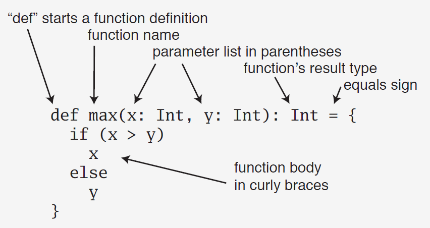
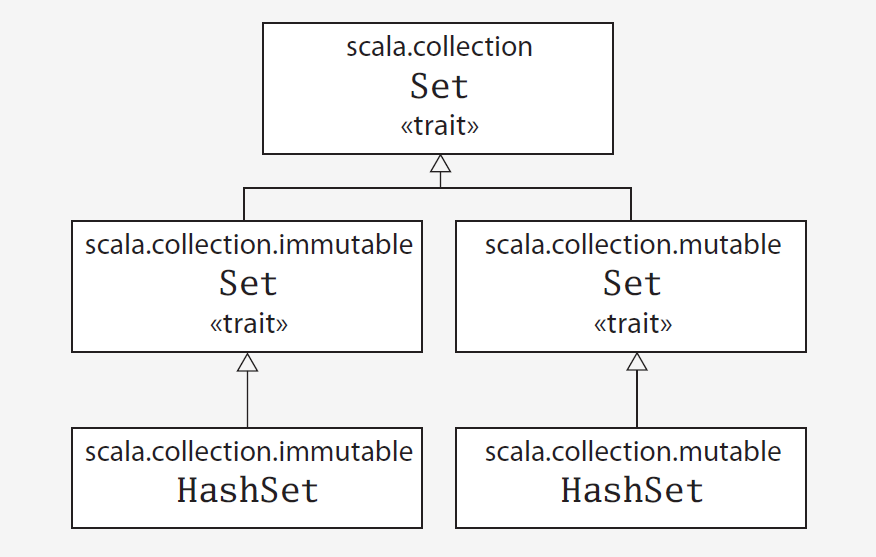
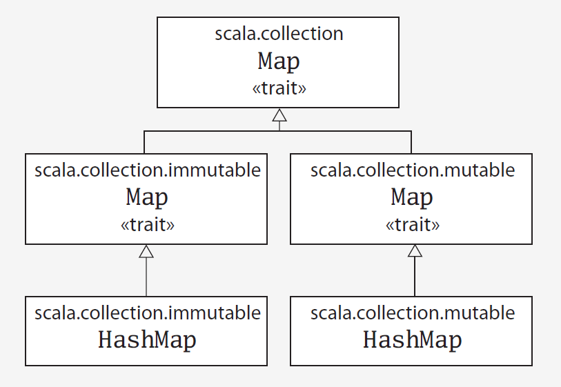

## Intellij y Scala Worksheets

Cuando uno trabaja con scripts en scala normalmente no son archivos validos de scala por que solo contienen expresiones, para poder trabajar con scripts es recomendable guardarlos como archivos `.sc`, estos son los famosos `worksheets`.

## Parámetros en Metodos y Return Types


La definición clásica de un metodo o función sería la siguiente:



que visto en una linea de código sería:

```scala
def max(x: Int, y: Int): Int = if (x > y) x else y
```
la cual esta completamente tipeada, aunque podemos quitar el return type.

```scala
def max(x: Int, y: Int) = if (x > y) x else y
```

 aunque lo recomendado como buena practica es siempre tipear todo, si vemos el lado derecho, nos daremos cuenta que es muy parecido al condicion presente en muchos otros lenguajes `(x > y) ? x : y`, pero con una sintaxis un tanto más clara para todos los que venian usando el operador condicional `if`.

En Scala no existe el tipo void, por lo cual para poder imprimir en pantalla el return type equivalente es `Unit`:
```scala
def sayHi(name: String): Unit =
  println(s"hello $name")

sayHi("Scala class")
```

Este tipo `Unit` se reserva para los metodos que tienen efectos secundarios, por lo cual en metodos I/O es un ejemplo clásico de esto.

Recuerda en Scala todo tiene un tipo!

Aunque en algunas versiones podemos usar la sintaxis procedural, esta desaconsejada, por que en algún punto será retirada del lenguaje.


```scala
def sayHi(name: String){
  println(s"hello $name")
}
sayHi("Scala class")
```

## Tuplas 

Este tipo de dato nos permite regresar conjutos de datos

```scala
def sumAndDifference(a: Int, b: Int): (Int, Int) = {
  val sum = a + b
  val difference = a - b
  (sum, difference)
}

val res = sumAndDifference(10, 5)
```
Para accesar el resultado usamos `_` y el indice del elemento.

```scala
res._1
res._2
```
otra manera más conveniente es recibir los reultados en un tupla:

```scala
val (sm, df) = sumAndDifference(10, 5)

val (a,b,c,d,e) = (0, 'u', 8, 1, "too")
```

La maxima cantidad de elementos que puede tener una tupla es 22.

## Colecciones
La API de colecciones de bastante amplia, por el momento nos enfocaremos en las típicas colecciones con algunas fuinciones básicas, arreglos, listas, secuencias,...

- Arreglos: Son coleciones mutables.
- Listas: Son colecciones inmutables.
- Vectores: Son colecciones inmutables.
- Set: Existen ambos tipos mutables e inmutables.
- Map: Existen ambos tipos mutables e inmutables.

Tanto los arreglos como las listas con un subtipo de la clase Seq(secuencias).


```scala
val array1: Array[Int] = Array(1,2,3)
val list1: List[String] = List("Jose", "Jorge", "Javier")

val array2 = Array(1,2,3)
val list2 = List("Jose", "Jorge", "Javier")

def squareRootsOf(xs: List[Int]): List[Double] = {
  for (x <- xs) yield math.sqrt(x)
}

squareRootsOf(List(1,2,3,4,5,6))
```

Hay varias maneras de inicializar una lista:

```scala

val lista = List(1,2,3)

val listb = 4 :: 5 :: 6 :: Nil

val listc = lista ::: listb

val listd = Nil.::(3).::(2).::(1)
```

```scala
scala> Seq(1,2,3)
res19: Seq[Int] = List(1, 2, 3)
```
```scala
scala> val l1: Seq[Int]  = List(1,2,3)
l1: Seq[Int] = List(1, 2, 3)
```
```scala
scala> val a1: Seq[Int]  = Array(1,2,3)
a1: Seq[Int] = WrappedArray(1, 2, 3)
```


Otro tipo de colección es el vector:

```scala
scala> val v1 = Vector(1,2,3)
v1: scala.collection.immutable.Vector[Int] = Vector(1, 2, 3)
```


Para poder iterar sobre cualquiera de estas colecciones usaremos el hecho de que todas son subtipos de secuencias `Seq`.

```scala
def squareRootOfAll(xs: Seq[Int]): Seq[Double] =
  xs.map(x => math.sqrt(x))
```
de está manera no importa si se trata de una lista, arreglo o vector, nuestra función será capaz de iterarla.


### Set

En matemáticas, un conjunto es una colección de elementos considerada en sí misma como un objeto. Por defecto los Set en Scala son objetos inmutables, sin embargo la API nos permite tener una versión mutable, estos se encuentrán en `scala.collection`.

```scala
scala> Set(1,2,3,4,3,2,1)
res20: scala.collection.immutable.Set[Int] = Set(1, 2, 3, 4)
```

Los Sets no mantienen el orden, por lo cual no cumplen con ser secuencias, si no otro tipo de colección.



```scala
import scala.collection._

scala> val s1 = mutable.Set(1,2,3)
s1: scala.collection.mutable.Set[Int] = Set(1, 2, 3)
scala> var s2 = immutable.Set(1,2,3)
s2: scala.collection.immutable.Set[Int] = Set(1, 2, 3)

scala> s1 += 4// contiene el operador +=
res21: s1.type = Set(1, 2, 3, 4)
s2 += 4 // la variable es reasignada
```

Para agrear elementos a un set basta con usar el metodo `+=`.

No se recomienda, ni se requiere usar var junto con una colección mutable.

Aunque las implementaciones por defecto de `set` no son suficiente para todos los posibles problemas, aunque
la librería nos permite crear varios tipos de datos que nos pueden ser muy utiles como hashset:


```scala
scala> :paste
// Entering paste mode (ctrl-D to finish)

import scala.collection.immutable.HashSet
val hashSet = HashSet("Tomates", "Chiles")
println(hashSet + "Pimientos")

// Exiting paste mode, now interpreting.

Set(Tomates, Pimientos, Chiles)
import scala.collection.immutable.HashSet
hashSet: scala.collection.immutable.HashSet[String] = Set(Tomates, Chiles)
```

### Map

Al igual que en el caso de `set` tenemos mapas mutables e inmutables que son accesibles a tráves de las API.




```scala
scala> val m1 = mutable.Map('a'->1, 'b'->2, 'c'->3)
m1: scala.collection.mutable.Map[Char,Int] = Map(b -> 2, a -> 1, c -> 3)
scala> var m2 = immutable.Map('d'->4, 'e'->5, 'f'->6)
m2: scala.collection.immutable.Map[Char,Int] = Map(d -> 4, e -> 5, f -> 6)

scala> m1 ++= m2 // calls ++= on the mutable map
res24: m1.type = Map(e -> 5, b -> 2, d -> 4, a -> 1, c -> 3, f -> 6)
scala> m2 += 'g'->7 // rewrites to m2 = m2 + 'g'->7
scala> m2
res28: scala.collection.immutable.Map[Char,Int] = Map(d -> 4, e -> 5, f -> 6, g -> 7)
```


## Metodo de Extension ->
- -> puede ser llamado una instancia por cualquier tipo con un parámetro de cualquier otro tipo.
- El resultado es una tupla2[PrimerTipo, SegundoTipo] con los valores de ambas instancias.
- No existe para Int pero es llamado implicitamente `ArrowAssoc`

```scala
scala> 1 -> 2
res29: (Int, Int) = (1,2)

scala> "hello" -> "world"
res30: (String, String) = (hello,world)

scala> ArrowAssoc("hello").->(88)
res31: (String, Int) = (hello,88)
```

## Como iterar mapas

```scala
for((step, instruction) <- mapToIterate){
    println(s"Step $step - $instruction")
}
```
```scala
scala> for((key, value) <- m1) println(s"$key $value")
e 5
b 2
d 4
a 1
c 3
f 6
```


## Abrir y leer un Archivo


Un pequeño programa para leer las lineas de un archivo sería el siguiente:
```scala
import scala.io.Source

if (args.length > 0) {
  for (line <- Source.fromFile(args(0)).getLines)
    print(line.length +" "+ line)
  }
else
  Console.err.println("Please enter filename")
```

realmente la parte importante es que estamos usando la librería `Source` para realizar las tareas de entrada/salida en nuestros códigos hechos en Scala.
```scala
import scala.io.Source

for(line <- Source.fromFile("somefile.txt").getLines()){
    println(line)
}
```
si nosotros deseamos realizar varias operaciones con estas lineas, bien podemos guardarlas en una contenedor:
```scala
val lines = Source.fromFile(args(0)).getLines.toList
```
En está ultima llamada notemos que el metodo `getLines` regresa un cursor, sin embargo al usar el metodo `toList` lo obligamos a regresar todos los elementos por los que pasaria el cursor, dandonos la libertad de trabajar estas lineas como nosotros queramos, igual tener cuidado al momento de manejar archivos grandes.

