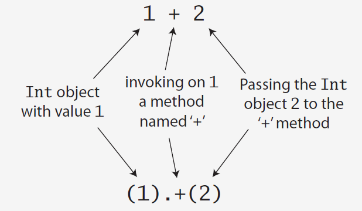

# Clases en Scala
## Definición

La definición de una clase puede ser tan sencilla como:

```scala
scala> class demo
defined class demo
```
o

```scala
scala> class Person{}
defined class Person
```

e instanciar un objeto de está clase sería:

```scala
scala> val joe = new Person
defined class Person
joe: Person = Person@65901cf2
```
Una vez que una clase es creada podemos crear multiples objectos o instancias de dicha clase.

Los miembros que conforman una clase son:
- Campos (Fields)
- Metodos (Methods)

Agregando un poco de información a la clase Person, tendriamos lo siguiente

```scala
scala> class Person{
    var name = ""
}
```
Por defectos lo miembros de una clase son publicos, sin embargo, usando la palabra reservada `private` podemos crear miembros privados en dichas clases.

```scala
scala> class Person{
    private var name = ""
    def getName() = name
    def setName(newName: String) = {
        name = newName
    }

}
```


En la JVM todos los metodos, campos deben estar dentro de alguna clase a diferencia de REPL, en Scala esto incluye a objetos, traits y objetos empaquetados. Recordemos que una clase es una espcie de blueprint de un objecto.

En Scala podemos instanciar objetos o instancias de clases usando la palabra reservada `new`:

```scala
val big = new java.math.BigInteger("12345678910")
```

podemos parametrizar con tipos usando el especificador en los corchetes.

```scala
scala> :paste
// Entering paste mode (ctrl-D to finish)

val str = new Array[String](4)
str(0) = "Scala "
str(1) = "Hello "
str(2) = "World"
str(3) = "!!!\n"
for(i <- 0 to 3)
    print(str(i))

// Exiting paste mode, now interpreting.

Scala Hello World!!!
str: Array[String] =
Array("Scala ", "Hello ", World, "!!!")
```

Podriamos ser un poco más específicos al declarar con:
```scala
val str: Array[String] = new Array[String](4)
```

Notar que en el ejemplo anterior aunque estamos usando una variable val y esta no puede ser reasignada, esto no implica
que los objetos internos no puedan ser cambiados!!!

En Scala no se tiene sobrecarga de operadores, pero si permite crear metodos con cuyos nombes son: `+`, `-`, `*+*`, `/`, etc. Es decir, cuando escribimos `1+2` realmente estamos mandando llamar el metodo `+`, por lo tanto tiene sentido `(1).+(2)`!!!



El "operador" `()` realmente es el metodo `.apply()`, esto ayuda a entender el comportamiento de la mayoria de los objetos en Scala, por ejemplo, al accesar un elemento de un `Array` usando el operador `()`, realmente estamos haciendo una llamada a un metodo `apply`. 

Cuando hacemos una asignación a través del operador `()` realmente estamos invocando otro metodo:
```scala 
str(0) = "Scala "
```
es equivalente a 

```scala 
str.update(0, "Scala ")
```

Siempre que tengamos un objeto, el punto a la derecha del objeto indica un metodo de este objeto `obj.`, asi los dos puntos `::obj` a la izquierda indican un metodo de este objeto.


## Constructor

```scala
scala> class DemoWithFieldsAndMethods{
     |     val x: Int = 10;
     |     val y: Int = x*2;
     |     def timesY(a:Int ): Int = a*y;
     | }
defined class DemoWithFieldsAndMethods

scala> val demoWithFieldsAndMethods = new DemoWithFieldsAndMethods
demoWithFieldsAndMethods: DemoWithFieldsAndMethods = DemoWithFieldsAndMethods@5104f4e6

scala> demoWithFieldsAndMethods.x
res38: Int = 10

scala> demoWithFieldsAndMethods.timesY(4)
res39: Int = 80
```

```scala
class DemoWithParameter(name: String){
    println(s"Constructor para $name")
    def sayHi(times:Int): Unit = {
        var time = 0;
        while(time < times){
            println("s"Hi, $name")
            time += 1
        }
    }
}

```


## Parámetros, campos, y campos paramétricos

- Los parametros de un constructor son privados (private[this])
```scala
scala> :paste
// Entering paste mode (ctrl-D to finish)

class DemoWithPrivateParams(name: String){
  println("Hello $name")
}

val demo = new DemoWithPrivateParams("Jill")

demo.name

// Exiting paste mode, now interpreting.

<pastie>:22: error: value name is not a member of DemoWithPrivateParams
demo.name
```
- `private` y `protected` son palabras reservadas, no existe ninguna palabra reservada para `public`, es el valor por defecto para `vals` y `defs`, aunque no para los parámetros de constructores.
- Agregando la palabra reservada `val` antes de la deinifición de un parámetro lo convierte en un parámetro publico:
```scala
scala> :paste
// Entering paste mode (ctrl-D to finish)

class DemoWithPublicParams(val name: String){
  println("Hello $name")
}

val demo = new DemoWithPublicParams("Pepe")

demo.name


// Exiting paste mode, now interpreting.

Hello $name
defined class DemoWithPublicParams
demo: DemoWithPublicParams = DemoWithPublicParams@378ccf23
res41: String = Pepe
```
- Los campos paramétricos son idiomaticos en Scala
Asi que aunque no podemos modificar el parámetro al ser privado podemos crear una copia del mismo en modo inmutable usando `val`:

```scala
scala> :paste
// Entering paste mode (ctrl-D to finish)


class DemoWithParams(_name: String){
    val name: String = _name
    println(s"Constructor para $name")
}

val demo = new DemoWithParams("Pepe")

demo.name

// Exiting paste mode, now interpreting.

Constructor para Pepe
defined class DemoWithParams
demo: DemoWithParams = DemoWithParams@474a0166
res44: String = Pepe
```


### Ejemplo creando una clase para manejar números racionales

```scala
scala> :paste
// Entering paste mode (ctrl-D to finish)

class Rational(val n: Int, val d: Int)

val half = new Rational(1, 2)

// Exiting paste mode, now interpreting.

defined class Rational
half: Rational = Rational@d0f5c3
```

Cada clase tiene un metodo `toString` el cual puede ser sobrecargado(overriden):

```scala
scala> :paste
// Entering paste mode (ctrl-D to finish)

class Rational(val n: Int, val d: Int){
    override def toString: String = s"R($n/$d)"
}
val half = new Rational(1, 2)
val divByZero = new Rational(1, 0)

// Exiting paste mode, now interpreting.

defined class Rational
half: Rational = R(1/2)
divByZero: Rational = R(1/0)
```


## Revisando Precondiciones

Es posible agregar precondiciones al momento de instanciar un clase en Scala usando la palabra reservada `require` justo al inicio
de la clase:

```scala
scala> :paste
// Entering paste mode (ctrl-D to finish)

class Rational(val n: Int, val d: Int){
    require(d != 0, "El denominador no puede ser cero!!!") // precondici├│n

    override def toString: String = s"R($n/$d)"
}
val half = new Rational(1, 2)
val divByZero = new Rational(1, 0)

// Exiting paste mode, now interpreting.

java.lang.IllegalArgumentException: requirement failed: El denominador no puede ser cero!!!
  at scala.Predef$.require(Predef.scala:281)
  ... 40 elided
```

## Auto referencia

En este ejemplo estamos creando el metodo `min`, que evalua los valores de la propia clase y los valores del argumento,o segundo operando, con ello decidir si debemos regresar el objeto a cual pertenece el metodo usando la palabra reservada `this` o simplemente regresamos el segundo operando.

```scala
class Rational(val n: Int, val d: Int) {
  require(d != 0, "El denominador no puede ser cero!!!")

  override def toString: String = s"R($n/$d)"

  def min(other: Rational): Rational =
    if ((n.toDouble / d) < (other.n.toDouble / other.d))
      this else other

  def +(other: Rational): Rational =
    new Rational(
      this.n * other.d + this.d * other.n,
      this.d * other.d
    )

  def add(other: Rational): Rational =
    new Rational(
      this.n * other.d + this.d * other.n,
      this.d * other.d
    )
}
```

## Constructores Auxiliares

Ahora consideremos el caso de querer sumar un primitivo a nuestro número racional:

```scala
val sum = half + 1
```
la manera de hacer funcionar esto es crear un constructor para que funcione a partir de enteros:


```scala
class Rational(val n: Int, val d: Int) {
  require(d != 0, "El denominador no puede ser cero!")

  override def toString: String = s"R($n/$d)"

  def this(i: Int) = this(i, 1)

  def min(other: Rational): Rational =
    if ((n.toDouble / d) < (other.n.toDouble / other.d))
      this else other

  def +(other: Rational): Rational =
    new Rational(
      this.n * other.d + this.d * other.n,
      this.d * other.d
    )
}
```
```scala
val sum = half + new Rational(1)
```

Ahora otra estrategia para resolver este problema es usar un **metodo factory**, justo como funciona el `apply` en el caso de colecciones.

## Objectos Acompañantes y Metodos Factory

- Tienen el mismo nombre que la clase (o `trait`)
- Empiezan con la palabra reservada `object`, esto indica que es un objeto singleton
- Está en el mismo archivo fuente
- Tiene acceso a miembros privados!!!


En este caso en el mismo archivo donde está la clase Rational agregariamos el siguiente código:

```scala
object Ractional{
  def apply(n: Int, d: Int): Rational = new Rational(n, d)
  def apply(i: Int): Rational = new Rational(i, 1)
}
```

Y con esto tenemos el comportamiento deseado usando objetos acompañantes!, estos objetos acompañantes funcionan como los usuales metodos estaticos de otros lenguajes(JAVA, C++).

Cargando esto con un `:paste`:
```scala
scala> :paste
class Rational private (val n: Int, val d: Int) {
  require(d != 0, "El denominador no puede ser cero!")

  override def toString: String = s"R($n/$d)"

  def min(other: Rational): Rational =
    if ((n.toDouble / d) < (other.n.toDouble / other.d))
      this else other

  def +(other: Rational): Rational =
    new Rational(
      this.n * other.d + this.d * other.n,
      this.d * other.d
    )
}
object Rational {
  def apply(n: Int, d: Int): Rational = {
    println(s"Creando un nuevo Rational con $n y $d")
    new Rational(n, d)
  }
  def apply(i: Int): Rational = {
    println(s"Creando un nuevo Rational con $i")
    new Rational(i, 1)
  }
    
}
// Notar que aqui usamos el factory method en lugar de instanciar la clase con new!!! de hecho no existe new para la variable five
val fifth = Rational(1, 5)
val five = Rational(5)
val sum = five + fifth

Creando un nuevo Rational con 1 y 5
Creando un nuevo Rational con 5
defined class Rational
defined object Rational
fifth: Rational = R(1/5)
five: Rational = R(5/1)
sum: Rational = R(26/5)
```


Veamos el siguiente [ejemplo](codigos/clase_04/MathCompanion.scala)

```scala
scala> :paste
// Entering paste mode (ctrl-D to finish)

object MathCompanion{
    def sum(a: Int, b: Int): Int = a + b
    def getPrivateMember: Int = new MathCompanion().max
}

class MathCompanion{
    private val max = 100
}

// Exiting paste mode, now interpreting.

defined object MathCompanion
defined class MathCompanion
```
Ahora hagamos uso de este objecto singleton:
```scala
scala> MathCompanion.sum(1,2)
res59: Int = 3

scala> MathCompanion.get
getClass   getPrivateMember

scala> MathCompanion.get
getClass   getPrivateMember

scala> MathCompanion.getPrivateMember
res60: Int = 100
```

## Constructores Privados

Cuando trabajamos con objetos acompañantes, a veces no queremos que el usuario sea capaz de instanciar directamente la clase para esto usamos la palabra clave `private`:

```scala
scala> :paste
// Entering paste mode (ctrl-D to finish)

class demoPrivate private(val n: Int){
  println(s"Mi clase privada instanciada con $n")
}

val test1 = new demoPrivate(5)

// Exiting paste mode, now interpreting.

<pastie>:15: error: constructor demoPrivate in class demoPrivate cannot be accessed in object $iw
val test1 = new demoPrivate(5)
```
como se puede apreciar esto protege la clase de ser instanciada.

Si agregamos el objeto acompañante:


```scala
scala> :paste
// Entering paste mode (ctrl-D to finish)

class demoPrivate private(val n: Int){
  println(s"Mi clase privada instanciada con $n")
}

object demoPrivate {
  def apply(n: Int): demoPrivate = {
    println(s"Mi clase privada instanciada con $n a tráves de un factory")
    new demoPrivate(n)
  }
}


val test1 = demoPrivate(5)

// Exiting paste mode, now interpreting.

Mi clase privada instanciada con 5 a tráves de un factory
Mi clase privada instanciada con 5
defined class demoPrivate
defined object demoPrivate
test1: demoPrivate = demoPrivate@7530090a
```
Solo recordemos que ya no podremos instaciar directamente, es decir nuestro `new` ya no sirve bajo este contexto.

```scala
scala> val test2 = new demoPrivate(5)
<console>:13: error: constructor demoPrivate in class demoPrivate cannot be accessed in object $iw
       val test2 = new demoPrivate(5)
```

Hasta el momento usar clases privados con objetos acompañantes, parece ser el patrón correcto a usar en Scala.

## Sobrecarga de Operadores

Ahora como hacemos la sobrecarga de operadores o almenos como simulamos `Rational(1,2) + 1`, lo que haremos será sobrecargar el operador, que en Scala quiere decir sobrecargar el metodo:

```scala
scala> :paste
// Entering paste mode (ctrl-D to finish)
class Rational private (val n: Int, val d: Int) {
  require(d != 0, "El denominador no puede ser cero!")

  override def toString: String = s"R($n/$d)"

  def +(other: Rational): Rational = {
    println(s"Sumando $n / $d + ${other.n} / ${other.d}")
    //println(s"Sumando1 $n / $d + $other")
    new Rational(
      this.n * other.d + this.d * other.n,
      this.d * other.d
    )
  }

  def +(i: Int): Rational ={
    println(s"Sumando2 $n / $d + $i")
    this + Rational(i) 
  }
    
}

object Rational {
  def apply(n: Int, d: Int): Rational =
    new Rational(n, d)

  def apply(i: Int): Rational =
    new Rational(i, 1)
}

val half = Rational(1, 2)

half + 5

// Exiting paste mode, now interpreting.

Sumando2 1 / 2 + 5
Sumando 1 / 2 + 5 / 1
defined class Rational
defined object Rational
half: Rational = R(1/2)
res1: Rational = R(11/2)
```

## Conversión Implicita

Ahora que pasa con `5+half`, como resolvemos eso, para ello se crea una función para conversión implicita, usando la palabra reservada `implicit`, sin embargo para lograr esto debemos importar esta funcionalidad `import scala.language.implicitConversions`:

```scala
scala> :paste
import scala.language.implicitConversions
class Rational private (val n: Int, val d: Int) {
  require(d != 0, "El denominador no puede ser cero!")

  override def toString: String = s"R($n/$d)"

  def +(other: Rational): Rational = {
    println(s"Sumando $n / $d + ${other.n} / ${other.d}")
    //println(s"Sumando1 $n / $d + $other")
    new Rational(
      this.n * other.d + this.d * other.n,
      this.d * other.d
    )
  }

  def +(i: Int): Rational ={
    println(s"Sumando2 $n / $d + $i")
    this + Rational(i) 
  }
}

object Rational {
  def apply(n: Int, d: Int): Rational =
    new Rational(n, d)

  implicit def apply(i: Int): Rational =
    new Rational(i, 1)
}

val half = Rational(1, 2)

half + 5

Rational(5) + half

5 + half

// Exiting paste mode(without import), now interpreting.

<pastie>:40: warning: implicit conversion method apply should be enabled
by making the implicit value scala.language.implicitConversions visible.
This can be achieved by adding the import clause 'import scala.language.implicitConversions'
or by setting the compiler option -language:implicitConversions.
See the Scaladoc for value scala.language.implicitConversions for a discussion
why the feature should be explicitly enabled.
  implicit def apply(i: Int): Rational =
               ^
Sumando2 1 / 2 + 5
Sumando 1 / 2 + 5 / 1
Sumando 5 / 1 + 1 / 2
Sumando 5 / 1 + 1 / 2
defined class Rational
defined object Rational
half: Rational = R(1/2)
res2: Rational = R(11/2)


// Exiting paste mode, now interpreting.

Sumando2 1 / 2 + 5
Sumando 1 / 2 + 5 / 1
Sumando 5 / 1 + 1 / 2
Sumando 5 / 1 + 1 / 2
import scala.language.implicitConversions
defined class Rational
defined object Rational
half: Rational = R(1/2)
res3: Rational = R(11/2)
```
Resumiendo

- Para usar conversión implcita debemos importar la libreria.
- Ya no necesitamos sobrecargar el operador(metodo)!!!
- Las conversiones implictas solo tienen un tipo de entrada y un solon tipo en la salida.
- Cuando tenemos problemas de tipos en los objectos acompañantes es cuando usamos conversiones implicitas.
- Se desaconseja su uso en estos objetos acompañantes.
- No importa el nombre si no el tipo.


