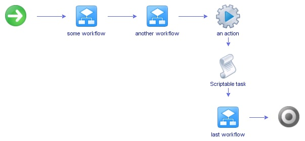
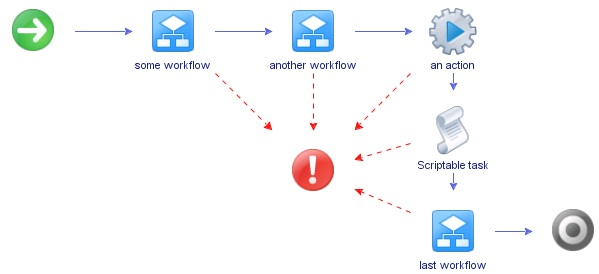

# Exceptions in Scala

An exception is an unwanted or to be more specific it is an **unexpected** event, which occurs during the execution/compilation of a program usually at run time, that disrupts the normal flow of the program’s instructions. 

## JAVA Exceptions

In java there are two class of exceptions that comes from `Throwable` class:

- `Error`: These ones are related with errors in JVM.
- `Exception`: Errors related with the behavior of our program are represented by `Exception` subclasses.

Since JDK 7, there are 3 new characteristics:
- Try for resources, it seems resources are free in an automatic way.
- Multi-catch `catch(Exception1 | Exception2 | ... )`
- `rethrow`

Then we can use multi-catch in scala!!!

### Multi-catch example:
```scala
object MultiCatch {
  def main(args: Array[String]): Unit = {
    val a = 28
    val b = 0
    var resultado = 0
    var chars = List('A', 'B', 'C')
    for (i <- 0 until 2) {
      try {
        if (i == 0)
          resultado = a / b //genera un ArithmeticException
        else
          chars = List('X') //genera un ArrayIndexOutOfBoundsException
      } catch {
        case e@(_: ArithmeticException | _: ArrayIndexOutOfBoundsException) => {
          println("Excepción multiple capturada: " + e)
        }
        case e@(_: ArithmeticException) => {
          println("Excepción única capturada: " + e)
        }
        case e => {
          println("Excepción capturada pero no identificada: " + e)
        }
      }
    }
    println("Después del multi-catch")
  }
}

MultiCatch.main(Array())
```

```scala
defined object MultiCatch

Excepción única capturada: java.lang.ArithmeticException: / by zero
Después del multi-catch
```

El primero es compatible con la gestión automática de recursos, que automatiza el proceso de liberación de un recurso, como un archivo, cuando ya no es necesario. Se basa en una forma expandida de , llamada declaración (try con recursos), y se describe más en Java Avanzado, cuando se discuten los archivos.
La segunda característica nueva se llama multi-catch.
Y la tercera a veces se llama final rethrow o more precise rethrow. Estas dos características se describen aquí.


## Throw an Exception

In Scala as in Java, the way to throw an exception is through new parameters or making a general common exception, for example try to make a common error like:

```scala
val x = 5/0
// result 
java.lang.ArithmeticException: / by zero
  ... 37 elided
```
the root of these exceptions comes from JAVA.

```scala
throw new IllegalArgumentException
```

example

```scala
val x = 5
if (x == 5){
  throw new IllegalArgumentException  
}
```

result in:

```scala
x: Int = 5
java.lang.IllegalArgumentException
  ... 37 elided
```

## Throwing and catching an exception

```scala
def failingFn(i: Int): Int = {
  val y: Int = throw new Exception("fail!")
  try {
    val x = 42 + 5
    x + y
  }
  catch {
    case e: Exception => 43
  }
}
// Exiting paste mode, now interpreting.

def failingFn(i: Int): Int
```

As you can see is well defined, however during call on of this in REPL provokes a crash:

```scala
scala> failingFn(5)
java.lang.Exception: fail!
  at failingFn(<pastie>:2)
  ... 32 elided
  ```

It is almost clear that variable our `y` is not referentially transparent. 

We can test that subsituing `y` by `((throw new Exception("fail!")): Int)`, it obtains a different result!!!

```scala
scala> def failingFn2(i: Int): Int = {
     |   try {
     |     val x = 42 + 5
     |     x + ((throw new Exception("fail!")): Int)
     |   }
     |   catch {
     |     case e: Exception => 43
     |   }
     | }
def failingFn2(i: Int): Int

scala> failingFn2(5)
val res10: Int = 43
```

Remember that an expression Referential Transparent means this expression does not depends on context.

As summary:
- Exceptions break Referential Trasparent and introduce context dependence.
- Exceptions are not type-safe. The type of `failingFn`, `Int => Int` tells us nothing about the fact that exceptions may occur, and the compiler will certainly not force callers of failingFn to make a decision about how to handle those exceptions. If we forget to check for an exception in failingFn, this won’t be detected until runtime!!!

## Why use exceptions vs return value?

There are cases where use an exception could be faster and healthy however in the case os Scala it seems many times better use return values.


## Checked vs Unchecked Exceptions in Java

In JAVA checked exceptions at least force a decision about whether to handle or re-raise an error, but they result in significant boilerplate(in some way we are agains boilerplates) for callers.

### Checked Exceptions

These are the exceptions that are checked at compile time. If some code within a method throws a checked exception, then the method must either handle the exception or it must specify the exception using the throws keyword. 

```java
import java.io.*;
class exmaple_01 {
	public static void main(String[] args)
	{
		FileReader file = new FileReader("C:\\test\\a.txt");
		BufferedReader fileInput = new BufferedReader(file);
		for (int counter = 0; counter < 3; counter++)
			System.out.println(fileInput.readLine());
		fileInput.close();
	}
}
```
result:
```bash
jalonzo@MacBook-Pro-de-Jose clase_09 % javac example_01.java 
example_01.java:11: error: unreported exception FileNotFoundException; must be caught or declared to be thrown
		FileReader file = new FileReader("C:\\test\\a.txt");
		                  ^
example_01.java:18: error: unreported exception IOException; must be caught or declared to be thrown
			System.out.println(fileInput.readLine());
			                                     ^
example_01.java:22: error: unreported exception IOException; must be caught or declared to be thrown
		fileInput.close();
		               ^
3 errors
```

the fix really is easy:

```java
import java.io.*;
class exmaple_01 {
	public static void main(String[] args)
		throws IOException
	{
		FileReader file = new FileReader("C:\\test\\a.txt");
		BufferedReader fileInput = new BufferedReader(file);
		for (int counter = 0; counter < 3; counter++)
			System.out.println(fileInput.readLine());
		fileInput.close();
	}
}
```
class exmaple_01 was created, which means compiled successfully.

```bash
jalonzo@MacBook-Pro-de-Jose clase_09 % javac example_01_fix.java 
jalonzo@MacBook-Pro-de-Jose clase_09 % ls
exmaple_01.class		example_01.java		example_01_fix.java
```

## Unchecked Exceptions 

These are the exceptions that are not checked at compile time. BTW in C++, all exceptions are unchecked, so it is not forced by the compiler to either handle or specify the exception. It is up to the programmers to be civilized, and specify or catch the exceptions. In Java exceptions under Error and RuntimeException classes are unchecked exceptions, everything else under throwable is checked. 

Consider the following Java program. It compiles fine, but it throws ArithmeticException when run. The compiler allows it to compile because ArithmeticException is an unchecked exception.

```java
class example_02 {
	public static void main(String args[])
	{
		int x = 0;
		int y = 10;
		int z = y / x;
	}
}

```

```bash
jalonzo@MacBook-Pro-de-Jose clase_09 % javac example_02.java
jalonzo@MacBook-Pro-de-Jose clase_09 % java example_02             
Exception in thread "main" java.lang.ArithmeticException: / by zero
	at example_02.main(example_02.java:15)
```


## Handling Errors using functional programming paradigm

The technique we use is based on an old idea: instead of throwing an exception, we return a value indicating that an exceptional condition has occurred.

```scala
def mean(xs: Seq[Double]): Double = 
  if (xs.isEmpty)
    throw new ArithmeticException("Mean of emty list!")
  else
    xs.sum / xs.length
```

Posible solutions of languages without exceptions:

- return xs.sum / xs.length (NaN)
- return some other sentinel value
- return null

this is the generical way to handle exceptions in language as C++

```c++
try {
   // protected code
} catch( ExceptionName e1 ) {
   // catch block
} catch( ExceptionName e2 ) {
   // catch block
} catch( ExceptionName eN ) {
   // catch block
} catch( ... ){
  // bad practice, usually teams in C++ discourage use it 
}
```
in C++ we have `throw` word we can invent very complex Exceptions

```c++
try{
  throw 1;
}catch (int e){
    std::cout << "Something wrong happed " << e << std::endl;
}
```

Problems:
- It allows errors to **silently propagate**.
- Explicit if statements to check whether the caller has received a "real" result.
- It’s not applicable to polymorphic code. For some output types, we might not even have a sentinel value of that type even if we wanted to! Consider a function like max, which finds the maximum value in a sequence according to a custom comparison function: `def max[A](xs:Seq[A])(greater:(A,A)=>Boolean): A`. If the input is empty, we can’t invent a value of type A. Nor can null be used here, since null is only valid for non-primitive types, and A may in fact be a primitive like Double or Int.
- It demands a special policy or calling convention of callers

Another possibility is to force the caller to supply an argument that tells us what to do in case we don’t know how to handle the input:
```scala
def mean_1(xs: IndexedSeq[Double], onEmpty: Double): Double = 
  if (xs.isEmpty)
    onEmpty
  else
    xs.sum / xs.length
```

## The Option data type

The solution is to represent explicitly in the return type that a function may not always have an answer. 

We are deferring to the caller for the error-handling strategy, to achieve this we introduce a new type, `Option`. This type exists in the Scala standard library, but we’re re-creating it here to understand how works, `Option` has two cases: it can be defined, in which case it will be a `Some`, or it can be undefined, in which case it will be `None`.

```scala
sealed trait Option[+A]
case class Some[+A](get: A) extends Option[A]
case object None extends Option[Nothing]
```

```scala
def mean(xs: Seq[Double]): Option[Double] =
  if (xs.isEmpty) 
    None
  else 
    Some(xs.sum / xs.length)
```

LR
(metodo1, metodo1.1, metodo1.1.1, )

The return type now reflects the possibility that the result may not always be defined, with this `mean` is a total function.

In math $ mean(s) = \left{ \right. $ // fix visualization of maths

**In the core of this way esscencially the responsability falls in developers, can be a pattern, however and analysis of this is something to be discussed** 

## Usage patterns for Option

What makes `Option` convenient is that we can factor out common patterns of error handling via higher-order functions, freeing us from writing the usual boilerplate that comes with exception-handling code. 


```scala
trait Option[+A] {
  def map[B](f: A => B): Option[B] // Apply f if the Option is not None.
  def flatMap[B](f: A => Option[B]): Option[B] //Apply f if the Option if not None.
  def getOrElse[B >: A](default: => B): B // B >: A says that the B paremeter must be a supertype of A.
  def orElse[B >: A](ob: => Option[B]): Option[B] // Don't evaluate ob unless needed.
  def filter(f: A => Boolean): Option[A] // convert Some to None is the value doesn't satisfy f.
}
```

Solution to exercise 4.1 considering current None and Option

```scala
// Hide Option, None from std
import scala.{Option => _}
import scala.{Either => _}

sealed trait Option[+A] {
  def map[B](f: A => B): Option[B] = {
    this match {
      case None => None
      case Some(a) => Some(f(a))
    }
  }
  def flatMap[B](f: A => Option[B]): Option[B] = {
    this match {
      case None => None
      case Some(a) => f(a)
    }
  }
  def getOrElse[B >: A](default: => B): B = {
    this match {
      case None => default
      case Some(a) => a
      case _ => default
    }
  }
  def orElse[B >: A](ob: => Option[B]): Option[B] = {
    this match {
      case None => ob
      case Some(a) => this
      case _ => ob
    }
  }
  def filter(f: A => Boolean): Option[A] = {
    this match {
      case Some(a) if f(a) => this
      case _ => None
    }
  }
}

case class Some[+A](get: A) extends Option[A]
case object None extends Option[Nothing]

object Option {
  def mean(xs: Seq[Double]): Option[Double] = {
    if (xs.isEmpty) 
      None
    else 
      Some(xs.sum / xs.length)
  }
}

val me = None
val f = ((a: Int) => a.toString)
if(None == (me.map(f))){
  println("None in map working fine!")
}

val me = Some(3)
val f = ((a: Int) => a.toString)
if(Some("3") == me.map(f)){
  println("Some in map working fine!")
}
```


Exercise 4.2

Remember that $\sigma^{2} = \frac{1}{n}\sum_{x}(x-\mu)^{2}$

```scala
def variance(xs: Seq[Double]): Option[Double] = {
  mean(xs).flatMap(m => mean(xs.map(x => math.pow(x - m, 2))))
}
```

```scala
//takecare!!!!!
//val xs = Seq(1, 2, 3, 4, 5)
val xs = Seq(1, 2, 3, 4, 5.0)
val sigma2 = Option.variance(xs)
```

## Option composition, lifting, and wrapping exception-oriented APIs

```scala
def lift[A,B](f: A => B): Option[A] => Option[B] = _ map f
```

```scala
val absO: Option[Double] => Option[Double] = lift(math.abs)
```

Excercise 4.3
Write a generic function map2 that combines two Option values using a binary function. If either Option value is None, then the return value is too. Here is its signature:
```scala
def map2[A,B,C](a: Option[A], b: Option[B])(f: (A, B) => C): Option[C]
```

solution:

```scala
def map2[A, B, C](a: Option[A], b: Option[B])(f: (A, B) => C): Option[C] = {
  (a, b) match {
      case (Some(a), Some(b)) => Some(f(a, b)) 
      case _ => None 
    }
  }
```

### Excercise 4.4
Write a function sequence that combines a list of Options into one Option containing a list of all the Some values in the original list. If the original list contains None even once, the result of the function should be None; otherwise the result should be Some with a list of all the values. Here is its signature:3
```scala
def sequence[A](a: List[Option[A]]): Option[List[A]]
```
solution:

```scala
def sequence[A](a: List[Option[A]]): Option[List[A]] = {
  a.foldRight(Some(Nil): Option[List[A]])((x, y) => map2(x, y)(_::_))
}
```

def traverse[A, B](a: List[A])(f: A => Option[B]): Option[List[B]]

Implement traverse function. It’s straightforward to do using map and sequence, but try for a more efficient implementation that only looks at the list once. In fact, imple- ment sequence in terms of traverse.


```scala
def traverse[A, B](a: List[A])(f: A => Option[B]): Option[List[B]] = {
    a.foldRight(Some(Nil): Option[List[B]])((x, y) => map2(f(x), y)(_::_))
  }
```
TODO: Revisar para la siguiente for-comprehension


```scala
def mean(xs: IndexedSeq[Double]): Either[String, Double] = {
  if (xs.isEmpty)
    Left("mean of empty list!")
  else
    Right(xs.sum / xs.length)
}
```

Excercise 4.6
Implement versions of map, flatMap, orElse, and map2 on Either that operate on the
Right value.
```scala
import scala.{Either => _}

sealed trait Either[+E, +A] {
  def map[B](f: A => B): Either[E, B] = this match {
    case Right(a) => Right(f(a))
    case Left(e) => Left(e)
  }

  def flatMap[EE >: E, B](f: A => Either[EE, B]): Either[EE, B] = this match {
    case Right(a) => f(a)
    case Left(e) => Left(e)
  }

  def orElse[EE >: E, B >: A](b: => Either[EE, B]): Either[EE, B] = this match {
    case Left(e) => b
    case _ => this
  }
  // TODO: revisar
  def map2[EE >: E, B, C](b: Either[EE, B])(f: (A, B) => C): Either[EE, C] = (this, b) match {
    case (Right(aa), Right(bb)) => Right(f(aa, bb))
    case (Left(e), _) => Left(e)
    case (_, Left(e)) => Left(e)
  }
}
case class Left[+E](value: E) extends Either[E, Nothing]
case class Right[+A](value: A) extends Either[Nothing, A]

object Either {
  def Try[A](a: => A): Either[Exception, A] = {
    try Right(a)
    catch { 
      case e: Exception => Left(e) 
      }
  }

  def mean(xs: IndexedSeq[Double]): Either[String, Double] = {
    if (xs.isEmpty) 
      Left("Mean of empty list!")
    else 
      Right(xs.sum / xs.length)
  }

```

## How to detect an Exception and what to do

We have different types of Exceptions and Scopes for them. There are many mecanisms to capture exceptions dependinng in the scope of the exception.

A simple easy way is bubble exceptions, depending the nature of the application we can choose this one over other, which makes troubleshooting "easy", ugly for user but easier for developers and helping to decouple  the mantainance.



 a classic one is give to each application a exit way, where exceptions will be handled, this way usually finished being a hard way to handle expceptions, very hard to maintain and affecting seriously the `latency`, however it is easier to debug, and help us to keep tracking of events, then I can not discard this way.



Here the trick is define `barriers` for our asyncronic events.


Does not matter the way, always can exist pitfalls, if for some reason the `special word` used is not catched then we have a trouble, regardless there exist generical ways to handle exceptions, it is important to know when a exception should be handled or only catched.


```scala

```

```scala

```

```scala

```

```scala

```

```scala

```


