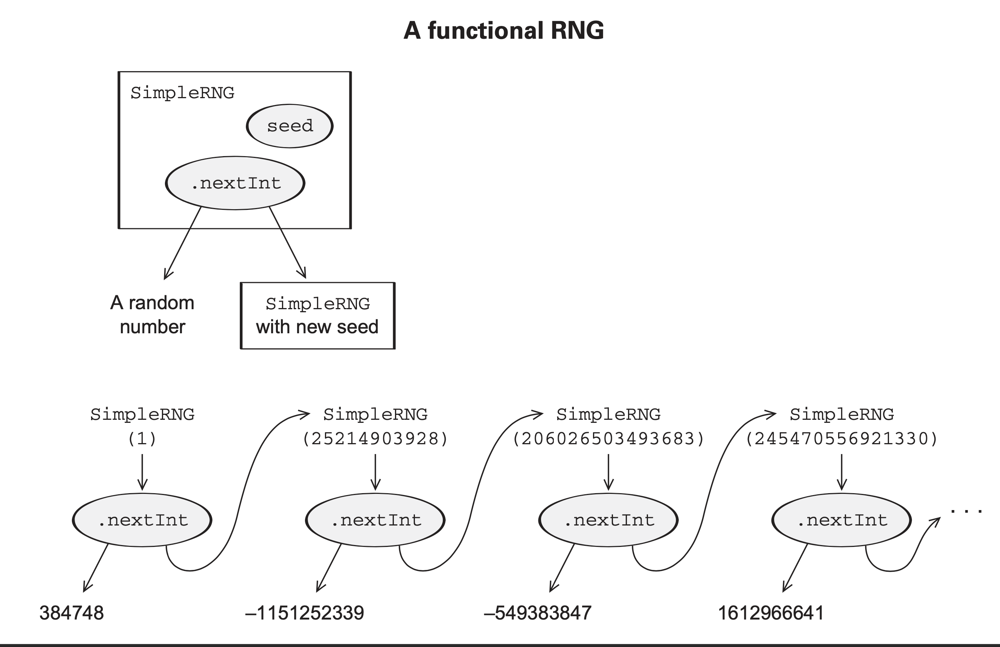

# Estados puramente funcionales

Una de las preguntas que resuelve esta sección es como convertir cualquier API stateful en una API puramente funcional. Muchas veces hacemos llamadas a API con ciertos parametros sin saber realmente cual será la respuesta. Esto es contrario a lo que usualmente trabajamos con APIs stateless. En el caso stateful los pasos anteriores tendrán efectos secundarios sobre las siguientes llamadas a la API. Consideremos un caso ficticio con llamadas a un generador de números aleatorios.

## Generemos números aleatorios con efectos secundarios.


La clase para generar numeros aleatorios en Scala es `scala.util.Random`.

```scala
scala> val random_number_generator = new scala.util.Random

val random_number_generator: scala.util.Random = scala.util.Random@fab35b1
```

Al evaluarla nos damos cuanta que la asignacion variable <-> metodo ya no es directa y nos pide especificar que estamos llamando al metodo usando los parentesis:
```scala
scala> random_number_generator.nextDouble
                               ^
       warning: Auto-application to `()` is deprecated. Supply the empty argument list `()` explicitly to invoke method nextDouble,
       or remove the empty argument list from its definition (Java-defined methods are exempt).
       In Scala 3, an unapplied method like this will be eta-expanded into a function.
val res1: Double = 0.7527099418267231
```

Si la implementacion de dicho metodo fuese funcional, al mandarlo llamar deberia dar el mismo resultado:
```scala
scala> random_number_generator.nextDouble()
val res2: Double = 0.3314069466517313
```
sin embargo como podemos ver no es el caso, asi que es claro que aunque no veamos la implementación del metodo por dentro tenbemos un estado que es modificado cada vez que mandamos llamar al metodo `nextDouble`, lo mismo ocurre con el metodo `nextInt`

```scala
scala> random_number_generator.nextInt()
val res3: Int = 230812798
```

inclusive puede recibir argumentos para especificar en que rango se buscara el número aleatorio.

```scala
scala> random_number_generator.nextInt(10)
val res4: Int = 2
```

evidentemente dichos metodos no son referencialmente transparentes.


```scala
scala> :paste
// Entering paste mode (ctrl-D to finish)
def rollDie: Int = {
    val rng = new scala.util.Random
    rng.nextInt(6) 
}
// Exiting paste mode, now interpreting.
def rollDie: Int
```

```scala
scala> rollDie
val res5: Int = 2

scala> rollDie
val res6: Int = 4

scala> rollDie
val res7: Int = 0
```


```scala
scala> def rollDie2(rng: scala.util.Random): Int = rng.nextInt(6)
def rollDie2(rng: scala.util.Random): Int
```

```scala
scala> rollDie2(random_number_generator)
val res10: Int = 1

scala> rollDie2(random_number_generator)
val res11: Int = 3

scala> rollDie2(random_number_generator)
val res12: Int = 2
```

# Generación de números aleatorios de manera puramente funcional

La manera de hacer esto es que las actualizaciones del estado interno se hagan de manera explicita:

```scala
scala> :paste
// Entering paste mode (ctrl-D to finish)
trait RNG{
    def nextInt: (Int, RNG)
}
// Exiting paste mode, now interpreting.
trait RNG
```

Este metodo generará un numéro aleatorio `Int`, pero en lugar de modificar el estado interno de la instancia a la que pertenece el metodo, regresará el nuevo estado. De esta manera separamos la responsabilidad del computo del siguiente estado, se la podemos comunicar al resto del programa sin modificar el estado interno de la instancia, regresando el nuevo estado a quien sea que halla llamado a la función, y el llamante tiene completo control de lo que hará con este nuevo estado.



```scala
scala> :paste
// Entering paste mode (ctrl-D to finish)
case class SimpleRNG(seed: Long) extends RNG {
    def nextInt: (Int, RNG) = {
        val newSeed = (seed * 0x5DEECE66DL + 0xBL) & 0xFFFFFFFFFFFFL
        val newRNG = SimpleRNG(newSeed)
        val n = (newSeed >>> 16).toInt
        (n, newRNG)
    }
}
// Exiting paste mode, now interpreting.
class SimpleRNG
```

```scala
scala> :paste
// Entering paste mode (ctrl-D to finish)
val rng0 = SimpleRNG(42)
val (n1, rng1) = rng0.nextInt
val (n2, rng2) = rng1.nextInt
val (n3, rng3) = rng2.nextInt
// Exiting paste mode, now interpreting.
val rng0: SimpleRNG = SimpleRNG(42)
val n1: Int = 16159453
val rng1: RNG = SimpleRNG(1059025964525)
val n2: Int = -1281479697
val rng2: RNG = SimpleRNG(197491923327988)
val n3: Int = -340305902
val rng3: RNG = SimpleRNG(259172689157871)
```
De esta manera hemos creado un generador de números aleatorios referencialmente transparente lo cual nos permite reproducir resultados!

```scala
scala> :paste
// Entering paste mode (ctrl-D to finish)
val rng0 = SimpleRNG(42)
val (n1, rng1) = rng0.nextInt
val (n2, rng2) = rng0.nextInt
val (n3, rng3) = rng0.nextInt
val (n4, rng4) = rng0.nextInt
// Exiting paste mode, now interpreting.
val rng0: SimpleRNG = SimpleRNG(42)
val n1: Int = 16159453
val rng1: RNG = SimpleRNG(1059025964525)
val n2: Int = 16159453
val rng2: RNG = SimpleRNG(1059025964525)
val n3: Int = 16159453
val rng3: RNG = SimpleRNG(1059025964525)
val n4: Int = 16159453
val rng4: RNG = SimpleRNG(1059025964525)
```

## Patrón para crear funciones puramente funcionales


Basicamente requerimos que cada API calcule su siguiente estado y lo regrese,
sin mutar variables internas!!! Evidentemente esto afectará el performance de nuestras APIs.

Asumiendo que `bar` y `barz` modifican el estado de `s`
```scala
class Foo {
    private var s: FooState = ... 
    def bar: Bar
    def baz: Int
}
```
Podemos crear una interface
```scala
trait Foo {
    def bar: (Bar, Foo) 
    def baz: (Int, Foo)
}
```

la cual nos permirte regresar el estado interno de la clase! y las responsabilidad vuelve a quien llama la clase, solo no olvidar que debe pasar el estado que necesita la clase para funcionar correctamente!!!


Ejercicio 1: Escribir una función que use RNG.nextInt para generar un entero aleatorio entre 0 y Int.maxValue. Asegurar de manejar el caso extremo cuando
nextInt regresa Int.MinValue, el cual no tiene una contra parte.

```scala
trait RNG:
  def nextInt: (Int, RNG)

object RNG:
    def nonNegativeInt(rng: RNG): (Int, RNG) = {
        val (n, int_rng) = rng.nextInt
        if (n < 0){
            ((n+1)*(-1), int_rng) // to handle Int.MinValue and negatives
        }else{
            (n, int_rng)
        }
    }
```
Ejercicio 2: Escribir una funcion para generar un Double entre `[0,1)`
```scala
trait RNG:
  def nextInt: (Int, RNG)

object RNG:
    def nonNegativeInt(rng: RNG): (Int, RNG) = {
        val (n, int_rng) = rng.nextInt
        if (n < 0){
            ((n+1)*(-1), int_rng) // to handle Int.MinValue and negatives
        }else{
            (n, int_rng)
        }
    }

    def double(rng: RNG): (Double, RNG) ={
        val (n, int_rng) = nonNegativeInt(rng)
        (n / (Int.MaxValue.toDouble + 1), int_rng)
    }
```
## Ejercicio 3 
Excribir una funcion para generar
- `(Int, Double)`
- `(Double, Int)`
- `(Double, Double, Double)`
reusando el código previsamente generado.

```scala
def intDouble(rng: RNG): ((Int,Double), RNG) ={
    val (n, int_rng1) = rng.nextInt
    val (d, int_rng2) = double(int_rng1)
    ((n, d), int_rng2)
}
def intDouble(rng: RNG): ((Int,Double), RNG) = {
    val ((n, d), int_rng) = intDouble(rng)
    ((d, n), int_rng)
}
def double3(rng: RNG): ((Double,Double,Double), RNG)={
    val (d1, int_rng1) = double(rng)
    val (d2, int_rng2) = double(int_rng1)
    val (d3, int_rng3) = double(int_rng2)
    ((d1, d2, d3), int_rng3)
}
```

### Ejercicio 4
Escribir una función que genere una lista de enteros aleatorios
```scala
trait RNG:
  def nextInt: (Int, RNG)

object RNG:
    def nonNegativeInt(rng: RNG): (Int, RNG) = {
        val (n, int_rng) = rng.nextInt
        if (n < 0){
            ((n+1)*(-1), int_rng) // to handle Int.MinValue and negatives
        }else{
            (n, int_rng)
        }
    }
    def ints(count: Int)(rng: RNG): (List[Int], RNG) = {
        if (count == 0) {
            (List(), rng)
        }else{
            val (x, int_rng1)  = rng.nextInt
            val (xs, int_rng2) = ints(count - 1)(int_rng1)
        }
        (x :: xs, r2)
    }
```


# State actions o State Transitions

```scala
type Rand[+A] = RNG => (A, RNG)
```

```scala
val int: Rand[Int] = _.nextInt
```

```scala
def unit[A](a: A): Rand[A] = { 
    rng => (a, rng) 
}

```

```scala
def map[A,B](s: Rand[A])(f: A => B): Rand[B] = {
    rng => {
    val (a, rng2) = s(rng)
        (f(a), rng2)
    }
}
    
```

```scala
def nonNegativeEven: Rand[Int] = map(nonNegativeInt)(i => i - i % 2)
```

### Ejercicio 5
Usa map para implementar `double`

Antes teniamos esta solución:
```scala
def double(rng: RNG): (Double, RNG) ={
        val (n, int_rng) = nonNegativeInt(rng)
        (n / (Int.MaxValue.toDouble + 1), int_rng)
    }
```
Ahora usando map
```scala
val double: Rand[Double] = {
    map(nonNegativeInt)( n=> n / (Int.MaxValue.toDouble + 1))
}
```
### Ejercicio 6

Write the implementation of map2 based on the following signature. This function takes two actions, ra and rb, and a function f for combining their results, and returns a new action that combines them:
def map2[A,B,C](ra: Rand[A], rb: Rand[B])(f: (A, B) => C): Rand[C]


 Implementar `flatMap` y reusar flatMap para reimplementar nonNegativeLess Thabn
```scala

```

