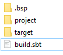

# SBT 

SBT es una herramienta muy útil en Scala que podemos descargar desde [https://www.scala-sbt.org/](https://www.scala-sbt.org/). 


sbt es una herramienta open source para proyectos en Scala(tambien en JAVA), algo asi como Maven o Ant.

Sus principales caracteristicas son:
- Soporte nativo para compilar código en Scala, asi como integracion con muchos marcos de trabajo para Scala.
- Compilación continua
- Compilacion y testeo incremental!!!
- Manejo de dependencias con la herramienta Apache Ivy
- Soporte para proyectos mixtos JAVA/Scala


para usar sbt un archivo `.sbt` con la configuración básica debe existir en el directorio donde se corra sbt.

Podemos ver la documentación en el sitio [https://www.scala-sbt.org/1.x/docs/](https://www.scala-sbt.org/1.x/docs/)


donde podemos ver los pasos básicos para instalar sbt en cualquiera de los OS Windows, MAC o Linux.


Para crear el ejemplo más básico:
```bash
$ mkdir example_01
$ cd example_01
$ touch build.sbt
```
finalmente corremos la instrucción `sbt`
```
example_01> sbt
[info] Updated file D:\Scala-Notes\sbt\examples\example_01\project\build.properties: set sbt.version to 1.5.5
[info] welcome to sbt 1.5.5 (Oracle Corporation Java 1.8.0_301)
[info] loading global plugins from C:\Users\username\.sbt\1.0\plugins
[info] loading project definition from D:\Scala-Notes\sbt\examples\example_01\project
[info] loading settings for project example_01 from build.sbt ...
[info] set current project to example_01 (in build file:/D:/Scala-Notes/sbt/examples/example_01/)
[info] sbt server started at local:sbt-server-3f475ab5c36000b0e76d
[info] started sbt server
sbt:example_01>
```

A pesar de que el archivo estaba vacio podemos notar que genero algunos archivos y carpetas.



para salir del shell de sbt escribimos `exit` o `Ctrl+D`(UNIX), `Ctrl+Z`(Windows) .


## Compilación

```
sbt
compile
```
o 
`sbt compile`

```bash
sbt:example_01> compile
[success] Total time: 0 s, completed 30/12/2021 11:53:10 PM
```

```
PS D:\Scala-Notes\sbt\examples\example_01> sbt compile
[info] welcome to sbt 1.5.5 (Oracle Corporation Java 1.8.0_301)
[info] loading global plugins from C:\Users\username\.sbt\1.0\plugins
[info] loading project definition from D:\Scala-Notes\sbt\examples\example_01\project
[info] loading settings for project example_01 from build.sbt ...
[info] set current project to example_01 (in build file:/D:/Scala-Notes/sbt/examples/example_01/)
[info] Executing in batch mode. For better performance use sbt's shell
[success] Total time: 0 s, completed 30/12/2021 11:53:54 PM
```

## Compilación continua

Para decirle a sbt que debe compilar cada vez que detecte un cambio usamos `~`

```bash
sbt:example_01> ~compile
[success] Total time: 0 s, completed 30/12/2021 11:53:10 PM
1. Waiting for source changes... (press enter to interrupt)
```

## Crear Source File

Dejamos el comando previo corriendo y cambiamos de shell.

Creamos los siguientes directorios dentro de la raiz del proyecto: `src/main/scala/example` dentro creamos el archivo `Hello.scala` conteniendo lo siguiente:

```scala
package example

object Hello extends App {
  println("Hello Scala World")
}
```

si sigue compilando nuestra ventana anterior esperamos a que deje de compilar, si no estaba compilando, compilamos y después corremos usando la instrucción `run`. Obtendrás las siguiente salida:

```bash
sbt:example_01> run
[info] running example.Hello
Hello Scala World
```

## Especificar la versión de Scala usando sbt shell

`set ThisBuild / scalaVersion := "2.13.6"`

```bash
sbt:example_01> set ThisBuild / scalaVersion := "2.13.6"
[info] Defining ThisBuild / scalaVersion
[info] The new value will be used by Compile / bspBuildTarget, Compile / dependencyTreeCrossProjectId and 49 others.
[info]  Run `last` for details.
[info] Reapplying settings...
[info] set current project to example_01 (in build file:/D:/Scala-Notes/sbt/examples/example_01/)
```

## Verificar la versión de Scala configurada

```bash
sbt:example_01> scalaVersion
[info] 2.13.6
```

## Para salvar los cambios hechos durante la sesión usamos `session save` 

```bash
sbt:example_01> session save
[info] Reapplying settings...
[info] set current project to example_01 (in build file:/D:/Scala-Notes/sbt/examples/example_01/)
[warn] build source files have changed
[warn] modified files:
[warn]   D:\Scala-Notes\sbt\examples\example_01\build.sbt
[warn] Apply these changes by running `reload`.
[warn] Automatically reload the build when source changes are detected by setting `Global / onChangedBuildSource := ReloadOnSourceChanges`.
[warn] Disable this warning by setting `Global / onChangedBuildSource := IgnoreSourceChanges`.
```

dentro del archivo podremos ver

`ThisBuild / scalaVersion := "2.13.6"`


## Dando nombre al proyecto
Agregamos las siguientes modificaciones a `build.sbt`

```
ThisBuild / scalaVersion := "2.13.6"
ThisBuild / organization := "com.example"

lazy val hello = (project in file("."))
  .settings(
    name := "Hello"
  )
```

y usamos `reload` para recargar la configuración:

```bash
sbt:example_01> reload
[info] welcome to sbt 1.5.5 (Oracle Corporation Java 1.8.0_301)
[info] loading global plugins from C:\Users\username\.sbt\1.0\plugins
[info] loading project definition from D:\Scala-Notes\sbt\examples\example_01\project
[info] loading settings for project hello from build.sbt ...
[info] set current project to Hello (in build file:/D:/Scala-Notes/sbt/examples/example_01/)
sbt:Hello>
```

## Test

### Agregar las dependencias necesarias

```bash
ThisBuild / scalaVersion := "2.13.6"
ThisBuild / organization := "com.example"

lazy val hello = (project in file("."))
  .settings(
    name := "Hello",
    libraryDependencies += "org.scalatest" %% "scalatest" % "3.2.7" % Test,
  )
```
### Run Test

Para correr los test usamos la instrucción `test`

```bash
sbt:Hello> test
[info] compiling 1 Scala source to D:\Scala-Notes\sbt\examples\example_01\target\scala-2.13\classes ...
[info] Non-compiled module 'compiler-bridge_2.13' for Scala 2.13.6. Compiling...
[info]   Compilation completed in 15.336s.
[success] Total time: 21 s, completed 31/12/2021 12:19:06 AM
```

### Run incremental tests continuamente 

`sbt:Hello> ~testQuick`

```bash
sbt:Hello> ~testQuick
[info] Passed: Total 0, Failed 0, Errors 0, Passed 0
[info] No tests to run for Test / testQuick
[success] Total time: 0 s, completed 31/12/2021 12:20:57 AM
[info] 1. Monitoring source files for hello/testQuick...
[info]    Press <enter> to interrupt or '?' for more options.
```
### Agregar Test

Crear archivo `src/test/scala/HelloSpec.scala` con el siguiente contenido:

```bash
import org.scalatest.funsuite._

class HelloSpec extends AnyFunSuite {
  test("hola Scala Mundo empieza con H") {
    assert("hola Scala Mundo".startsWith("H"))
  }
}
```

```bash
sbt:Hello> test
[info] compiling 1 Scala source to D:\Scala-Notes\sbt\examples\example_01\target\scala-2.13\test-classes ...
[info] HelloSpec:
[info] - hola Scala Mundo empieza con H *** FAILED ***
[info]   "hola Scala Mundo" did not start with "H" (HelloSpec.scala:5)
[info] Run completed in 474 milliseconds.
[info] Total number of tests run: 1
[info] Suites: completed 1, aborted 0
[info] Tests: succeeded 0, failed 1, canceled 0, ignored 0, pending 0
[info] *** 1 TEST FAILED ***
[error] Failed tests:
[error]         HelloSpec
[error] (Test / test) sbt.TestsFailedException: Tests unsuccessful
[error] Total time: 5 s, completed 31/12/2021 12:35:00 AM
```

Arreglando el código detectará el cambio y obtenemos:

```bash
[info] Build triggered by D:\Scala-Notes\sbt\examples\example_01\src\test\scala\HelloSpec.scala. Running 'testQuick'.
[info] compiling 1 Scala source to D:\Scala-Notes\sbt\examples\example_01\target\scala-2.13\test-classes ...
[info] HelloSpec:
[info] - Hola Scala Mundo empieza con H
[info] Run completed in 176 milliseconds.
[info] Total number of tests run: 1
[info] Suites: completed 1, aborted 0
[info] Tests: succeeded 1, failed 0, canceled 0, ignored 0, pending 0
[info] All tests passed.
[success] Total time: 1 s, completed 31/12/2021 12:36:03 AM
[info] 2. Monitoring source files for hello/testQuick...
[info]    Press <enter> to interrupt or '?' for more options.
```


## Iniciar REPL de Scala desde sbt

Usamos la instrucción `console`

## Crear subproyecto

Modificamos el `build.bst`, agregando `helloCore` y hacemos un `reload`

```
ThisBuild / scalaVersion := "2.13.6"
ThisBuild / organization := "com.example"

lazy val hello = (project in file("."))
  .settings(
    name := "Hello",
    libraryDependencies += "com.eed3si9n" %% "gigahorse-okhttp" % "0.5.0",
    libraryDependencies += "org.scalatest" %% "scalatest" % "3.2.7" % Test,
  )

lazy val helloCore = (project in file("core"))
  .settings(
    name := "Hello Core",
  )
```

## Listar proyectos


```
sbt:Hello> projects
[info] In file:/D:/Scala-Notes/sbt/examples/example_01/
[info]   * hello
[info]     helloCore
```
## Compilar un subproyecto

```
sbt:Hello> helloCore/compile
[warn] build source files have changed
[warn] modified files:
[warn]   D:\Scala-Notes\sbt\examples\example_01\build.sbt
[warn] Apply these changes by running `reload`.
[warn] Automatically reload the build when source changes are detected by setting `Global / onChangedBuildSource := ReloadOnSourceChanges`.
[warn] Disable this warning by setting `Global / onChangedBuildSource := IgnoreSourceChanges`.
[success] Total time: 0 s, completed 31/12/2021 10:40:02 AM
```

## Agregar ScalaTest al subproyecto
Modificamos `build.sbt` y agregamos `libraryDependencies += scalaTest % Test,`:
```
ThisBuild / scalaVersion := "2.13.6"
ThisBuild / organization := "com.example"

val scalaTest = "org.scalatest" %% "scalatest" % "3.2.7"

lazy val hello = (project in file("."))
  .settings(
    name := "Hello",
    libraryDependencies += "com.eed3si9n" %% "gigahorse-okhttp" % "0.5.0",
    libraryDependencies += scalaTest % Test,
  )

lazy val helloCore = (project in file("core"))
  .settings(
    name := "Hello Core",
    libraryDependencies += scalaTest % Test,
  )
```


## Broadcast commandos 
Configurar `agregate` en `build.sbt` para propagar comandos del proyecto `hello` al proyecto `helloCore`:

```
ThisBuild / scalaVersion := "2.13.6"
ThisBuild / organization := "com.example"

val scalaTest = "org.scalatest" %% "scalatest" % "3.2.7"

lazy val hello = (project in file("."))
  .aggregate(helloCore)
  .settings(
    name := "Hello",
    libraryDependencies += "com.eed3si9n" %% "gigahorse-okhttp" % "0.5.0",
    libraryDependencies += scalaTest % Test,
  )

lazy val helloCore = (project in file("core"))
  .settings(
    name := "Hello Core",
    libraryDependencies += scalaTest % Test,
  )
```

## Configurar dependencia de subproyectos

Usamos la instrucción `.dependsOn(helloCore)`

```
ThisBuild / scalaVersion := "2.13.6"
ThisBuild / organization := "com.example"

val scalaTest = "org.scalatest" %% "scalatest" % "3.2.7"

lazy val hello = (project in file("."))
  .aggregate(helloCore)
  .dependsOn(helloCore)
  .settings(
    name := "Hello",
    libraryDependencies += scalaTest % Test,
  )

lazy val helloCore = (project in file("core"))
  .settings(
    name := "Hello Core",
    libraryDependencies += "com.eed3si9n" %% "gigahorse-okhttp" % "0.5.0",
    libraryDependencies += scalaTest % Test,
  )
```


## Parse de JSON

Agregamos las librerias:

- `val gigahorse = "com.eed3si9n" %% "gigahorse-okhttp" % "0.5.0"`
- `val playJson  = "com.typesafe.play" %% "play-json" % "2.9.2"`

```
ThisBuild / scalaVersion := "2.13.6"
ThisBuild / organization := "com.example"

val scalaTest = "org.scalatest" %% "scalatest" % "3.2.7"
val gigahorse = "com.eed3si9n" %% "gigahorse-okhttp" % "0.5.0"
val playJson  = "com.typesafe.play" %% "play-json" % "2.9.2"

lazy val hello = (project in file("."))
  .aggregate(helloCore)
  .dependsOn(helloCore)
  .settings(
    name := "Hello",
    libraryDependencies += scalaTest % Test,
  )

lazy val helloCore = (project in file("core"))
  .settings(
    name := "Hello Core",
    libraryDependencies ++= Seq(gigahorse, playJson),
    libraryDependencies += scalaTest % Test,
  )
```
despues de `reload`, agregamos el siguiente archivo `core/src/main/scala/example/core/Weather.scala:`

```
package example.core

import gigahorse._, support.okhttp.Gigahorse
import scala.concurrent._, duration._
import play.api.libs.json._

object Weather {
  lazy val http = Gigahorse.http(Gigahorse.config)

  def weather: Future[String] = {
    val baseUrl = "https://www.metaweather.com/api/location"
    val locUrl = baseUrl + "/search/"
    val weatherUrl = baseUrl + "/%s/"
    val rLoc = Gigahorse.url(locUrl).get.
      addQueryString("query" -> "New York")
    import ExecutionContext.Implicits.global
    for {
      loc <- http.run(rLoc, parse)
      woeid = (loc \ 0  \ "woeid").get
      rWeather = Gigahorse.url(weatherUrl format woeid).get
      weather <- http.run(rWeather, parse)
    } yield (weather \\ "weather_state_name")(0).as[String].toLowerCase
  }

  private def parse = Gigahorse.asString andThen Json.parse
}
```
Aqui `Gigahorse` es un cliente HTTP para scala con Cliente Http Aync o Lightbend Akka HTTP underneath.

Ahora agregamos las siguientes lineas a `Hello.scala`:
```
package example

import scala.concurrent._, duration._
import core.Weather


object Hello extends App {
  println("Hello Scala World")
  val w = Await.result(Weather.weather, 10.seconds)
  println(s"Hello! The weather in New York is $w.")
  Weather.http.close()
}
```
por alguna razón al compilar a veces occure los siguiente:
```
sbt:Hello> compile
[error] Not a valid command: comple (similar: completions, client)
[error] Not a valid project ID: comple
[error] Expected ':'
[error] Not a valid key: comple (similar: compile, compilers, compileJava)
[error] comple
[error]       ^
```
en esos casos volver a compilar.

Después de que compile correctamente corremos usando la instrucción `run`:

```
sbt:Hello> run
[info] running example.Hello
Hello Scala World
Hello! The weather in New York is light rain.
```


## Agregar sbt-native-packager plugin

Creamos el archivo `project/plugins.sbt` con el siguiente contenido:

```bash
addSbtPlugin("com.typesafe.sbt" % "sbt-native-packager" % "1.3.4")
```

Ahora modificamos el archivo `build.sbt`:

```
ThisBuild / scalaVersion := "2.13.6"
ThisBuild / organization := "com.example"

val scalaTest = "org.scalatest" %% "scalatest" % "3.2.7"
val gigahorse = "com.eed3si9n" %% "gigahorse-okhttp" % "0.5.0"
val playJson  = "com.typesafe.play" %% "play-json" % "2.9.2"

lazy val hello = (project in file("."))
  .aggregate(helloCore)
  .dependsOn(helloCore)
  .enablePlugins(JavaAppPackaging)
  .settings(
    name := "Hello",
    libraryDependencies += scalaTest % Test,
  )

lazy val helloCore = (project in file("core"))
  .settings(
    name := "Hello Core",
    libraryDependencies ++= Seq(gigahorse, playJson),
    libraryDependencies += scalaTest % Test,
  )
```

recargadmos con `reload` y ejecutamos el creador de paquetes `dist`.

```bash
sbt:Hello> reload
[info] welcome to sbt 1.5.5 (Oracle Corporation Java 1.8.0_301)
[info] loading global plugins from C:\Users\username\.sbt\1.0\plugins
[info] loading settings for project example_01-build from plugins.sbt ...
[info] loading project definition from D:\Scala-Notes\sbt\examples\example_01\project
[info] loading settings for project hello from build.sbt ...
[info] set current project to Hello (in build file:/D:/Scala-Notes/sbt/examples/example_01/)
sbt:Hello> dist
[info] Wrote D:\Scala-Notes\sbt\examples\example_01\target\scala-2.13\hello_2.13-0.1.0-SNAPSHOT.pom
[info] Main Scala API documentation to D:\Scala-Notes\sbt\examples\example_01\target\scala-2.13\api...
[info] Main Scala API documentation successful.
[info] Wrote D:\Scala-Notes\sbt\examples\example_01\core\target\scala-2.13\hello-core_2.13-0.1.0-SNAPSHOT.pom
[info] Main Scala API documentation to D:\Scala-Notes\sbt\examples\example_01\core\target\scala-2.13\api...
[info] Main Scala API documentation successful.
[info] Your package is ready in D:\Scala-Notes\sbt\examples\example_01\target\universal\hello-0.1.0-SNAPSHOT.zip
[success] Total time: 6 s, completed 1/01/2022 11:03:08 PM
```

El paquete estara en formato `zip` en la carpeta `target/universal`

al descomprimir genera dos archivos para unix/win32 que nos permitiran ejecutar el paquete:

```
D:\TEMP\hello-0.1.0-SNAPSHOT\bin>hello
Hello Scala World
Hello! The weather in New York is light rain
```

## Dockerizar la aplicación


```
sbt:Hello> Docker/publishLocal
[info] Wrote D:\Scala-Notes\sbt\examples\example_01\core\target\scala-2.13\hello-core_2.13-0.1.0-SNAPSHOT.pom
[info] Main Scala API documentation to D:\Scala-Notes\sbt\examples\example_01\core\target\scala-2.13\api...
[info] Main Scala API documentation successful.
[info] :: delivering :: com.example#hello-core_2.13;0.1.0-SNAPSHOT :: 0.1.0-SNAPSHOT :: integration :: Sat Jan 01 23:09:24 CST 2022
[info]  delivering ivy file to D:\Scala-Notes\sbt\examples\example_01\core\target\scala-2.13\ivy-0.1.0-SNAPSHOT.xml
[info]  published hello-core_2.13 to C:\Users\username\.ivy2\local\com.example\hello-core_2.13\0.1.0-SNAPSHOT\poms\hello-core_2.13.pom
[info]  published hello-core_2.13 to C:\Users\username\.ivy2\local\com.example\hello-core_2.13\0.1.0-SNAPSHOT\jars\hello-core_2.13.jar
[info]  published hello-core_2.13 to C:\Users\username\.ivy2\local\com.example\hello-core_2.13\0.1.0-SNAPSHOT\srcs\hello-core_2.13-sources.jar
[info]  published hello-core_2.13 to C:\Users\username\.ivy2\local\com.example\hello-core_2.13\0.1.0-SNAPSHOT\docs\hello-core_2.13-javadoc.jar
[info]  published ivy to C:\Users\username\.ivy2\local\com.example\hello-core_2.13\0.1.0-SNAPSHOT\ivys\ivy.xml
[info] Wrote D:\Scala-Notes\sbt\examples\example_01\target\scala-2.13\hello_2.13-0.1.0-SNAPSHOT.pom
[info] Main Scala API documentation to D:\Scala-Notes\sbt\examples\example_01\target\scala-2.13\api...
[info] Main Scala API documentation successful.
[error] #2 [internal] load .dockerignore
[error] #2 sha256:5ec7c86aca72c74e936d99349df8ac08e9984d952f57850ab04cf29f566d6d10
...
[error] #9 DONE 0.2s
[error] Use 'docker scan' to run Snyk tests against images to find vulnerabilities and learn how to fix them
[info] Built image hello:0.1.0-SNAPSHOT
[success] Total time: 50 s, completed 1/01/2022 11:10:13 PM
```

Imagen creada
```bash
docker images
REPOSITORY                         TAG              IMAGE ID       CREATED         SIZE
hello                              0.1.0-SNAPSHOT   173fe41f552d   2 minutes ago   485MB
```


### Correr docker

```bash
docker run hello:0.1.0-SNAPSHOT
Hello Scala World
Hello! The weather in New York is light rain.
```

## Configurar la versión

Modificamos el archivo `build.sbt`:

```
ThisBuild / version      := "0.1.0"
ThisBuild / scalaVersion := "2.13.6"
ThisBuild / organization := "com.example"

val scalaTest = "org.scalatest" %% "scalatest" % "3.2.7"
val gigahorse = "com.eed3si9n" %% "gigahorse-okhttp" % "0.5.0"
val playJson  = "com.typesafe.play" %% "play-json" % "2.9.2"

lazy val hello = (project in file("."))
  .aggregate(helloCore)
  .dependsOn(helloCore)
  .enablePlugins(JavaAppPackaging)
  .settings(
    name := "Hello",
    libraryDependencies += scalaTest % Test,
  )

lazy val helloCore = (project in file("core"))
  .settings(
    name := "Hello Core",
    libraryDependencies ++= Seq(gigahorse, playJson),
    libraryDependencies += scalaTest % Test,
  )
```

## Cambiar la versión de Scala temporalmente

```
sbt:Hello> ++2.12.14!
[warn] build source files have changed
[warn] modified files:
[warn]   D:\Scala-Notes\sbt\examples\example_01\build.sbt
[warn] Apply these changes by running `reload`.
[warn] Automatically reload the build when source changes are detected by setting `Global / onChangedBuildSource := ReloadOnSourceChanges`.
[warn] Disable this warning by setting `Global / onChangedBuildSource := IgnoreSourceChanges`.
[info] Forcing Scala version to 2.12.14 on all projects.
[info] Reapplying settings...
[info] set current project to Hello (in build file:/D:/Scala-Notes/sbt/examples/example_01/)
```


```
sbt:Hello> scalaVersion
[info] helloCore / scalaVersion
[info]  2.12.14
[info] scalaVersion
[info]  2.12.14
```

```
sbt:Hello> help dist
Creates the distribution packages.
sbt:Hello> inspect dist
[info] Task: java.io.File
[info] Description:
[info]  Creates the distribution packages.
[info] Provided by:
[info]  ProjectRef(uri("file:/D:/Scala-Notes/sbt/examples/example_01/"), "hello") / dist
[info] Defined at:
[info]  (com.typesafe.sbt.packager.universal.UniversalPlugin.projectSettings) UniversalPlugin.scala:51
[info] Dependencies:
[info]  Universal / dist
[info] Delegates:
[info]  dist
[info]  ThisBuild / dist
[info]  Global / dist
[info] Related:
[info]  Universal-docs / dist
[info]  Universal / dist
[info]  Universal-src / dist
```

## Modo Batch

Podemos pasar las intrucciones en la linea de comando directamente a `sbt`
```
PS D:\Scala-Notes\sbt\examples\example_01> sbt clean "testOnly HelloSpec"
[info] welcome to sbt 1.5.5 (Oracle Corporation Java 1.8.0_301)
[info] loading global plugins from C:\Users\pepem\.sbt\1.0\plugins
[info] loading settings for project example_01-build from plugins.sbt ...
[info] loading project definition from D:\Scala-Notes\sbt\examples\example_01\project
[info] loading settings for project hello from build.sbt ...
[info] set current project to Hello (in build file:/D:/Scala-Notes/sbt/examples/example_01/)
[success] Total time: 0 s, completed 1/01/2022 11:22:01 PM
[info] compiling 1 Scala source to D:\Scala-Notes\sbt\examples\example_01\core\target\scala-2.13\classes ...
[info] compiling 1 Scala source to D:\Scala-Notes\sbt\examples\example_01\target\scala-2.13\classes ...
[info] Passed: Total 0, Failed 0, Errors 0, Passed 0
[info] No tests to run for helloCore / Test / testOnly
[info] compiling 1 Scala source to D:\Scala-Notes\sbt\examples\example_01\target\scala-2.13\test-classes ...
[info] HelloSpec:
[info] - Hola Scala Mundo empieza con H
[info] Run completed in 605 milliseconds.
[info] Total number of tests run: 1
[info] Suites: completed 1, aborted 0
[info] Tests: succeeded 1, failed 0, canceled 0, ignored 0, pending 0
[info] All tests passed.
[success] Total time: 13 s, completed 1/01/2022 11:22:14 PM
```

NOTA: Correr en modo batch requiere un spinup de la JVM y de JIT cada vez, lo cual hace el compilado mucho más lento, por lo cual siempre se recomienda trabajar con el sbt shell o mantener en modo test continuo con `~testQuick`.


## Comando sbt new

podemos usar `sbt new` para crear  un setup básico

```
PS D:\Scala-Notes\sbt\examples\example_02> sbt new scala/scala-seed.g8
[info] welcome to sbt 1.5.5 (Oracle Corporation Java 1.8.0_301)
[info] loading global plugins from C:\Users\username\.sbt\1.0\plugins
[info] set current project to new (in build file:/C:/Users/username/AppData/Local/Temp/sbt_2be39234/new/)
[info] downloading https://repo1.maven.org/maven2/org/scala-sbt/sbt-giter8-resolver/sbt-giter8-resolver_2.12/0.13.1/sbt-giter8-resolver_2.12-0.13.1.jar ...
...
[info]  [SUCCESSFUL ] org.scala-lang#scala-reflect;2.12.14!scala-reflect.jar (2537ms)
[info] resolving Giter8 0.13.1...

A minimal Scala project.

name [Scala Seed Project]: hello2

Template applied in D:\Scala-Notes\sbt\examples\example_02\.\hello2
```


